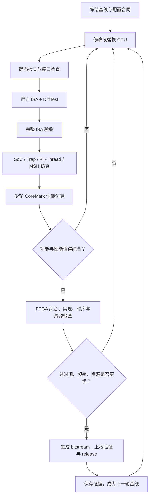

# SocRV AI 接手指南：CPU 迭代、验证、性能优化与 FPGA 交付闭环

> 适用对象：后续新接手 SocRV 的 AI 或工程师。  
> 目标：在不破坏 SoC、软件和 FPGA 合同的前提下，反复替换或优化 CPU，
> 用可复现的验证证据比较 CoreMark cycles、IPC、频率和资源，最终生成可上板、
> 可校验、可交付的 `rtthread-coremark` 版本。

本文不是架构设想，而是当前仓库的执行手册。若本文与代码不一致，应先读取实际
`Makefile`、JSON 合同和脚本，修正文档或实现，不能凭记忆继续操作。

---

## 1. 最终目标与 Loop Engineer Harness

最终 FPGA 应启动 RT-Thread 并进入 `msh >`。用户通过 UART 输入：

```text
help
ps
coremark 10000
```

CoreMark 必须输出参考 CRC、精确 total ticks/total time，结束后再次返回
`msh >`。CPU 优化目标不是单独追求最高 IPC 或最高综合频率，而是缩短实际
CoreMark 总时间：

```text
CoreMark time ≈ CoreMark cycles / SoC frequency
```

一次有效的工程闭环如下：



这个闭环就是 SocRV 的 Loop Engineer Harness。AI 的任务不是“改完 RTL
就结束”，而是让每项改动都经过相同的检查门，并留下可与上一版本比较的结果。

---

## 2. 接手后必须先建立的工程事实

### 2.1 首次进入仓库

仓库根目录是 `SocRV/`。开始任何修改前执行：

```bash
git status --short
make help
make doctor
make deps-check
make isa-gates
```

规则：

- 现有未提交改动属于用户，不能覆盖、回退或清理。
- 不修改 `software/*/upstream/` 和 `sim/reference/*/upstream/`。
- 不手改生成的 BSP 头文件、linker 常量或 `data/isa` 镜像。
- 不因为某项测试失败而缩小最终验收集合。
- 只有进入 FPGA 阶段且用户允许时，才运行 `fpga-build` 或
  `fpga-program`。日常 RTL/软件/Verilator 工作不调用 Vivado。

### 2.2 当前权威事实源

| 事实 | 权威文件 |
| --- | --- |
| Memory Map、Reset Vector | `data/soc/memory_map.json` |
| 当前/目标 ISA、ABI、时钟、IRQ、外设寄存器 | `data/soc/software_contract.json` |
| ISA 测试选择和排除原因 | `software/riscv-tests/tests.json` |
| 已生成 ISA 测试及 gate | `data/isa/manifest.json` |
| CPU/SoC RTL 文件集合 | `rtl/filelist.f` |
| Verilator 顶层文件集合 | `sim/filelists/soc_verilator.f` |
| FPGA 顶层文件集合 | `sim/filelists/fpga_kintex7.f` |
| 最终软件/FPGA profile | `data/profiles/rtthread-coremark.json` |
| 板卡器件和输入时钟 | `fpga/boards/kintex7_competition/board.json` |
| 顶层操作入口 | `Makefile` |

当前基线：

| 项目 | 当前值 |
| --- | --- |
| XLEN / endian | RV32 / little-endian |
| Reset Vector | `0x0000_0000` |
| CODE | `0x0000_0000`，64 KiB |
| DATA | `0x1000_0000`，64 KiB |
| SoC / Timer 时钟 | 50 MHz |
| UART | 115200, 8N1 |
| CPU 外部结构 | Harvard I-HXI + D-HXI |
| HXI outstanding | 每个 Master 最多一笔 |
| 最终整数 ISA | RV32IM + Zicsr + Zicntr + Zifencei |
| 必须通过 | RV32UI + RV32MI + RV32UM |
| 浮点 | F 或 FD，尚未冻结 |
| 最终软件 | RT-Thread + FinSH/MSH + CoreMark |

`learn/`、旧轮次目录和历史文档只能作为参考，不能覆盖上述权威事实。

---

## 3. 新 CPU 接入合同

### 3.1 只在 CPU subsystem 边界替换

当前替换点：

```text
rtl/cpu/cpu_subsystem.sv
```

`soc_core` 只实例化 `cpu_subsystem`。接入新 CPU 时，优先保持
`cpu_subsystem` 对 SoC 的端口不变：

```systemverilog
clk_i
rst_ni
instr_hxi         // instruction-side HXI master
data_hxi          // data-side HXI master
irq_software_i
irq_timer_i
irq_external_i
commit_o
fault_o
```

推荐做法：

```text
rtl/cpu/
├─ my_core/                  新 CPU 内部 RTL
├─ bus_adapter/              新 CPU 原生总线到 HXI 的适配器
├─ pkg/                      CPU 公共类型和配置
└─ cpu_subsystem.sv          唯一 SoC 接入点
```

不要为了迁就新 CPU，直接把专有取指、LSU 或 SRAM 端口扩散进
`soc_core`、Crossbar 或 FPGA 顶层。若新 CPU 不是原生 HXI，在 CPU 目录内写
适配器。

### 3.2 HXI 必须满足的行为

HXI 是分离请求/响应握手：

```text
request:
req_valid / req_ready
req_addr / req_write / req_wdata / req_wstrb

response:
rsp_valid / rsp_ready
rsp_rdata / rsp_err
```

新 CPU 或适配器必须保证：

- 请求在 `req_valid && !req_ready` 时保持地址、写标志、数据和 strobe 稳定。
- 请求只在 `req_valid && req_ready` 时被接受。
- 响应只在 `rsp_valid && rsp_ready` 时完成。
- 在响应完成前，不在同一 Master 上发出第二笔请求。
- I-HXI 只用于取指；D-HXI 用于 load/store、MMIO 和必要的代码区数据访问。
- I-HXI 和 D-HXI 命中不同 Slave 时允许并发，不能在 CPU 适配器中无故全局串行化。
- `rsp_err` 必须转换为正确的 instruction/load/store access fault。
- MMIO 访问不能被 cache、合并、重排或投机地产生架构副作用。

当前 Crossbar 支持 I/D 两个 Master 独立各保留一笔事务；它不是全局单事务总线。
如果新 CPU 内部支持多笔 outstanding，适配器第一版必须排队并降为 HXI 每端口
一笔，或者扩展整个 HXI 合同与 checker，不能直接丢弃 transaction identity。

### 3.3 中断、CSR 和异常

CPU 必须正确处理：

- Machine software interrupt；
- Machine timer interrupt；
- Machine external interrupt；
- `ecall`、`ebreak`、非法指令；
- instruction/load/store 地址或访问异常；
- `mret` 和 Machine CSR 状态变换；
- `mcycle/minstret` 以及 RV32 高半计数器；
- 项目选择的 misaligned 策略；当前合同为不支持，必须产生 Trap。

中断是电平输入。CPU 必须在架构允许的边界采样，并保证 `mepc` 指向正确的恢复
位置。乱序核必须先清空或精确取消年轻指令，再提交 Trap。

### 3.4 Commit trace 与 DiffTest

`commit_o` 是验证合同，不是调试时可随意填写的信号。普通退休指令、同步异常、
访存、CSR 快照和异步中断必须遵循
`rtl/cpu/pkg/cpu_types_pkg.sv` 的语义。

关键要求：

- `order` 单调递增。
- 普通指令：`valid=1, retired=1`。
- 同步异常：`valid=1, retired=0, sync_trap=1`。
- PC、instruction、GPR、访存 mask/data 必须是架构真实值。
- CSR 是事件发生前的架构状态。
- 乱序执行可以，但必须按架构退休顺序导出。
- 分支错误路径、被 flush 指令和投机访存不能成为退休事件。

当前 RTL 只导出一个退休槽。顺序双发射或乱序双发射接入时，C++ checker
已经按事件列表设计，但 RTL 顶层和 adapter 仍需扩展为多槽或增加无损退休事件
队列。不能只导出其中一条，也不能为了适配单槽而改变真实 `minstret`/IPC。

如果以后加入 F/FD，必须同时扩展：

- FPR 地址和写回值；
- `fflags/frm/fcsr`；
- `mstatus.FS`；
- 32/64-bit 浮点 load/store；
- Spike DiffTest 比较规则。

### 3.5 `fault_o`

正常运行时保持为 0。它用于报告无法继续的 CPU/适配器内部错误，不用于代替
RISC-V 架构 Trap，也不能把尚未实现的合法指令静默转成 `fault_o`。

---

## 4. 替换 demo CPU 的标准步骤

### Step 0：冻结可比较基线

修改前至少保存：

```bash
make check
make sim-isa ISA_GATE=final-base
make sim-rtthread
make sim-msh
make sim-coremark COREMARK_ITERATIONS=3
```

保存：

```text
build/regression/isa/final-base/summary.json
build/regression/msh/summary.json
build/result/soc/rtthread-coremark-command-3.json
build/images/rtthread-coremark/image.json
build/software/rtthread-coremark/build_manifest.json
build/verilator/soc/build_manifest.json
```

若基线本身失败，应先记录失败项，不要把它误判为新 CPU 引入的回退。

### Step 1：加入新 CPU RTL

1. 将新核放到 `rtl/cpu/<core-name>/`。
2. 若需要，增加 IFU/LSU 到 HXI adapter。
3. 在 `rtl/cpu/cpu_subsystem.sv` 替换 `demo_cpu_core` 实例。
4. 更新 `rtl/filelist.f`，保持 package 在 module 之前。
5. 不删除 demo core，直到新核完整通过基线；可以保留为显式可选 reference。
6. 检查 reset 极性、Reset Vector、未连接输出、宽度和 signedness。

### Step 2：同步 CPU/软件合同

检查并按实际能力更新：

```text
data/soc/software_contract.json
software/riscv-tests/tests.json
software/toolchain/common_flags.mk
software/profiles/rtthread-coremark.mk
```

当前 `software/toolchain/common_flags.mk` 已使用
`-march=rv32im_zicsr_zicntr_zifencei -mabi=ilp32`，并与 CPU 合同一致。以后修改 ISA
时仍必须同时更新 JSON、真实编译 flags 和 `COREMARK_FLAGS_TEXT`；`software/Makefile`
已跟踪所有 profile/toolchain make 片段，避免增量构建复用旧 ISA 的对象文件。

比较微架构版本时应固定同一个 ELF/hash。若同时改变 GCC 版本、优化参数或
`-march`，这属于新的软件基线，不能把全部收益归因于 CPU。

修改合同后执行：

```bash
make soc-contract
make isa-data
make check
```

`soc-contract` 会重生成 BSP 和 linker 事实；`isa-data` 会按照当前 Memory Map
重新生成 riscv-tests 镜像。

### Step 3：确认 SoC 配置适合新 CPU

逐项确认：

- 复位 PC 是否为 `0x0000_0000`。
- CODE/DATA 64 KiB 是否足够。
- 新核是否接受 Harvard I/D 端口和每端口一笔 outstanding。
- instruction 和 data 请求是否能并发。
- MMIO 是否 uncached、强顺序且不会 speculative issue。
- Timer/IRQ 的电平、中断 cause 和 CSR 位是否一致。
- UART divisor 是否对应 SoC 时钟。
- `fence.i` 是否能让取指侧看到先前数据写入代码区。
- 若加入 cache，reset、invalidate、写回和自修改代码语义是否明确。
- `CODE_MEM_RESPONSE_LATENCY` 和 `DATA_MEM_RESPONSE_LATENCY` 是否是 CPU
  adapter 能接受的值。

不要为了让 CPU 工作而在多个位置复制 Memory Map。地址与寄存器定义仍由 JSON
合同生成。

### Step 4：确认仿真和 FPGA IP 一致

当前两条路径共用：

- `soc_core`；
- HXI Crossbar、Timer、IRQ、UART、GPIO；
- `generic_rom/generic_spram` 的功能行为；
- 同一份 `code.mem/data.mem`；
- `CODE_MEM_RESPONSE_LATENCY`、`DATA_MEM_RESPONSE_LATENCY`。

FPGA 的 Xilinx memory wrapper 目前仍实例化相同 generic memory，以便综合推断
BRAM。因此仿真和 FPGA 的功能/初始化路径是一致的。

如果以后引入真正的 Xilinx Memory Generator、Multiplier、Divider 或 FPU IP，
必须同时提供：

1. FPGA wrapper；
2. Verilator 可用的行为模型；
3. 相同 latency、backpressure、reset 和 corner-case 合同；
4. 相同初始化镜像；
5. 一项比较两个 backend 行为的测试。

禁止在 Verilator 中用“零延迟理想模型”，而 FPGA 使用多周期 IP。否则仿真得到
的控制正确性和 IPC 都没有上板代表性。

---

## 5. 每轮 CPU 修改后的验证梯子

验证必须从便宜、定位清楚的门逐步上升。前一层失败时先修复，不要直接跑
CoreMark 或 Vivado。

### Gate A：静态与合同检查

```bash
make check
```

覆盖环境、依赖锁、生成文件、JSON schema、脚本单测、filelist、Memory Map 和
RTL lint。

通过标准：

- 命令返回 0；
- 生成文件没有 stale；
- RTL lint 无 error；
- 未出现未声明模块或 filelist 漏项。

### Gate B：定向 ISA 快速定位

刚修改某类指令时，只跑相关测试并开启 DiffTest：

```bash
python scripts/run_isa_tests.py \
  --gate final-base \
  --tests rv32ui/add \
  --difftest
```

替换 `rv32ui/add` 为实际失败项。常见选择：

```text
rv32ui/<instruction>     基本整数、branch、load/store、fence_i
rv32um/<instruction>     mul/div/rem
rv32mi/<test>            CSR、Trap、counter、PMP、misaligned
```

结果：

```text
build/result/soc/isa-<suite>-<test>-diff.json
build/log/difftest/isa-<suite>-<test>-diff.log
build/trace/difftest/isa-<suite>-<test>-diff.jsonl
```

DiffTest 首差异优先于波形。根据 `ORDER/PC/INSN/NEXT_PC/GPR/CSR/TRAP/MEM/IRQ`
定位。需要波形时再执行：

```bash
python scripts/run_isa_tests.py \
  --gate final-base \
  --tests rv32ui/add \
  --difftest \
  --trace
```

已有失败结果也可：

```bash
make diff-replay RESULT=<result.json> TRACE=1
```

### Gate C：完整 ISA

快速本地门：

```bash
make sim-isa ISA_GATE=current
```

最终整数签核门：

```bash
make diff-isa ISA_GATE=final-base
```

必须通过全部 RV32UI、RV32MI、RV32UM。不能把 `current` PASS 当作最终 CPU
完成；`current` 只是开发阶段快速门。

浮点选择冻结后，再加入对应 gate：

```text
F  → RV32UF
FD → RV32UF + RV32UD
```

### Gate D：SoC 与操作系统

按顺序执行：

```bash
make sim-smoke
make sim-trap-timer
make diff-smoke
make diff-rtthread
make sim-msh
```

它们分别验证：

| 命令 | 主要覆盖 |
| --- | --- |
| `sim-smoke` | 复位、取指、I/D HXI、BRAM、UART、TestStatus |
| `sim-trap-timer` | Trap frame、CSR、Timer IRQ |
| `diff-smoke` | SoC 裸机退休级架构效果 |
| `diff-rtthread` | RT-Thread 启动、MMIO、Timer、中断与 Spike 同步 |
| `sim-msh` | 最终 FPGA 镜像中的 `help`、`ps`、`uptime` 与真实 UART |

RT-Thread 必须进入完整 `msh >`；checker 检测到提示符后才发送命令。任何固定
cycle 盲发 UART 的做法都不属于有效验证。

### Gate E：少轮 CoreMark

```bash
make sim-coremark COREMARK_ITERATIONS=3
```

较长趋势检查：

```bash
make sim-coremark COREMARK_ITERATIONS=10
```

它们用于正确性和同配置下的性能趋势，不是正式 CoreMark 分数。必须确认：

- 三项参考 CRC 正确；
- `SocRV CoreMark CRC check PASS`；
- 性能窗口完整；
- 命令结束后重新出现 `msh >`；
- `result.json` 为 PASS。

CoreMark 性能仿真默认不打开逐指令 DiffTest。ISA 和 RT-Thread 已通过后，
长 benchmark 使用 DiffTest 会显著拖慢仿真，通常没有必要。

### Gate F：一键开发门和里程碑门

日常：

```bash
make sim-quick
```

里程碑：

```bash
make sim-full
```

`sim-full` 包括 final-base ISA、RT-Thread、MSH 和 CoreMark 10。任何一个失败都
不能进入正式 FPGA 交付。

---

## 6. 如何读取失败结果

### 6.1 通用结果

```text
build/result/soc/<test>.json
build/log/soc/<test>.log
build/wave/soc/<test>.vcd
build/regression/<suite>/summary.json
```

首先看：

```text
status
exit_reason
failure
checker.message
cycles
commits
last_commit_pc
reproduce
```

### 6.2 DiffTest

```text
difftest.passed
difftest.compared_events
difftest.last_order
failure.kind
failure.order
failure.cycle
```

调试顺序：

1. 读取首差异和前 64 条提交上下文。
2. 对照 firmware.dis 和 PC。
3. 判断是 CPU 架构错误、commit trace 错误还是 MMIO/IRQ 同步错误。
4. 用 `reproduce` 或 `diff-replay` 单项复现。
5. 只有日志无法区分时才开 VCD。

不要从 CoreMark 最后错误向前盲查数百万周期。应先把问题缩小到 ISA、Trap、
RT-Thread 启动或一个确定性 UART 命令。

---

## 7. 性能优化与 IPC/频率平衡

### 7.1 固定 50 MHz 下

当前仿真和 FPGA 默认都是 50 MHz，Timer 也每个 SoC cycle 增加。因此在相同
软件、Memory latency 和时钟下：

```text
更少 exact total ticks ≈ 更少 CoreMark cycles ≈ 更短运行时间
```

重点读取：

```text
build/result/soc/rtthread-coremark-command-<N>.json

performance.cycles
performance.commits
performance.ipc
performance.cycles_per_iteration
performance.commits_per_iteration
performance.iterations_per_second
```

IPC 只是原因指标，CoreMark cycles 才是固定频率下的直接结果。更高 IPC 可能被
更长分支恢复、LSU stall、较差代码布局或更慢时钟抵消。

### 7.2 跨 CPU 版本的公平比较

每个候选至少记录：

| 字段 | 用途 |
| --- | --- |
| Git commit 或完整 diff | 确认 RTL 版本 |
| software ELF SHA256 | 确认工作负载完全相同 |
| image manifest SHA256 | 确认 CODE/DATA 镜像 |
| Verilator model fingerprint | 确认模型没有复用过期构建 |
| Memory latency | 区分 CPU 与 BRAM 延迟收益 |
| CoreMark cycles/ticks | 固定频率性能 |
| commits / IPC | 微架构效率 |
| post-impl WNS | 时序余量 |
| LUT/FF/BRAM/DSP | 面积与资源代价 |
| board total ticks | 最终实测 |

不能把不同 GCC、不同 `-O`、不同 `-march`、不同 CoreMark 数据规模或不同 BRAM
latency 的结果放进同一条“CPU 优化曲线”。

### 7.3 频率变化

当前 FPGA MMCM 固定产生 50 MHz，软件合同、UART divisor、Timer 和
`COREMARK_TICKS_PER_SEC` 也按 50 MHz 配置。改变频率必须同步修改并验证：

```text
fpga/common/rtl/xilinx_clock_wrapper.sv
data/soc/software_contract.json
rtl/common/pkg/soc_config_pkg.sv
software/profiles/rtthread-coremark.mk
UART / Timer / XDC generated-clock expectations
```

然后重新执行：

```bash
make soc-contract
make isa-data
make check
make sim-full
make software-fpga
```

只改 MMCM 不改软件时间基准，会得到错误的 CoreMark seconds；只改软件常量不改
RTL，会得到错误的 UART 和 Timer 行为。

当前 Vivado gate 只验证设计在目标 50 MHz 下 timing met，并不自动搜索最大
Fmax。可以从关键路径延迟估算潜力，但不能把估算值当作已验证频率。真正做频率
sweep 时，应把频率作为受控 profile，逐点重新实现并保存报告。

### 7.4 选择候选的原则

对于候选 `i`：

```text
estimated_time_i = coremark_cycles_i / validated_frequency_i
```

优先保留 Pareto 候选：

- cycles 更少且频率不降低；
- 频率更高且 cycles 不增加；
- 总时间更短，资源增加仍在器件预算内。

不要仅凭单次综合或一次仿真淘汰所有其他候选。实现阶段的布局布线存在变化，
重要候选应保持相同约束重复验证并以上板结果收敛。

---

## 8. BRAM latency 调整方法

统一参数：

```text
rtl/common/pkg/soc_config_pkg.sv

CODE_MEM_RESPONSE_LATENCY
DATA_MEM_RESPONSE_LATENCY
```

每次只改变一个受控变量，并记录：

```text
latency 配置
ISA/RT-Thread 是否通过
CoreMark cycles、IPC
post-impl timing
资源
```

增加 latency 可能缩短组合路径、提高可实现频率，但会增加 load/fetch stall。
是否更优仍看：

```text
total time = cycles / validated frequency
```

新 CPU 必须能对任意合同允许的正 latency 正确背压，不能假设请求后一周期一定
返回。若 pipeline 只在 latency=1 工作，这是功能错误，不是性能问题。

---

## 9. 生成最终 FPGA 上板版本

进入本阶段前应满足：

```text
make check                              PASS
make diff-isa ISA_GATE=final-base      PASS
make sim-full                          PASS
make software-fpga                     PASS
```

确认工作树和版本：

```bash
git status --short
git rev-parse HEAD
```

正式构建：

```bash
make fpga-build PROFILE=rtthread-coremark JOBS=4
make fpga-check PROFILE=rtthread-coremark
```

`fpga-build` 才会调用 Vivado，并完成 software image、synthesis、
implementation、bitstream 和报告检查。

必须检查：

```text
build/vivado/kintex7-rtthread-coremark/result.json
build/vivado/kintex7-rtthread-coremark/project/socrv.xpr
build/vivado/kintex7-rtthread-coremark/project/reports/post_impl_timing_summary.rpt
build/vivado/kintex7-rtthread-coremark/project/reports/post_impl_drc.rpt
build/vivado/kintex7-rtthread-coremark/project/socrv.runs/impl_1/fpga_top.bit
```

签核标准：

- `result.json.status == PASS`；
- timing met；
- DRC error 为 0；
- `socrv.xpr` 可用于需要 GUI 检查的最终 FPGA 工程；
- bitstream 存在且 hash 已记录；
- CODE/DATA 镜像正是已通过仿真的 `rtthread-coremark` 镜像。

---

## 10. 上板验证

编程：

```bash
make fpga-program PROFILE=rtthread-coremark
```

串口：

```text
115200 baud
8 data bits
no parity
1 stop bit
no flow control
```

最小上板验收：

1. 上电/复位后出现 RT-Thread banner。
2. 出现完整 `msh >`。
3. `help` 中存在 `ps`、`uptime`、`socrv_info`、`coremark`。
4. `ps` 能列出 `tshell` 和 `tidle0`。
5. `socrv_info` 的 ISA、时钟和 UART 与交付配置一致。
6. 输入 `coremark 10000`。
7. 三项参考 CRC 和项目 CRC checker PASS。
8. 保存 exact total ticks、total time、ticks/iteration。
9. 命令完成后重新出现 `msh >`。
10. 再执行一次 `ps`，确认 RT-Thread shell 仍可工作。

板上日志必须完整保存，不能只手抄一个 CoreMark 数字。

---

## 11. 生成最终交付件

FPGA 构建和上板验收通过后：

```bash
make check-images
make release PROFILE=rtthread-coremark
make release-check PROFILE=rtthread-coremark
```

交付目录和压缩包：

```text
build/release/socrv-rtthread-coremark/
build/release/socrv-rtthread-coremark.zip
```

当前 release 包含：

```text
software/firmware.elf
software/firmware.map
software/firmware.dis
software/size.json
software/build_manifest.json
image/code.mem
image/data.mem
image/image.json
fpga/fpga_top.bit
fpga/post_impl_timing_summary.rpt
fpga/post_impl_drc.rpt
manifest.json
```

`manifest.json` 记录每个文件的 size 和 SHA256；`release-check` 会逐项复核。

当前打包脚本不自动包含全部仿真和上板证据。正式交付记录还应在压缩包旁保存：

```text
build/regression/isa/final-base/summary.json
build/regression/msh/summary.json
build/result/soc/rtthread-coremark-command-3.json
build/vivado/kintex7-rtthread-coremark/result.json
板上 UART 完整日志
Git commit / tag
CPU 配置、Memory latency、目标频率说明
```

没有这些证据的 bitstream 可以运行，但不能称为可复现的工程交付。

---

## 12. 每轮优化记录模板

后续 AI 每轮结束时应留下类似记录：

```text
Experiment:
  id:
  date:
  git_commit:
  dirty_worktree:

CPU:
  core:
  change:
  issue_width:
  retire_width:
  branch_predictor:
  memory_latency:

Software:
  elf_sha256:
  compiler:
  flags:
  march:
  coremark_iterations:

Verification:
  make_check:
  final_base_isa:
  difftest:
  rtthread:
  msh:
  coremark_crc:

Performance:
  cycles:
  commits:
  ipc:
  cycles_per_iteration:
  exact_total_ticks:

FPGA:
  target_frequency:
  timing_met:
  wns:
  lut:
  ff:
  bram:
  dsp:
  bitstream_sha256:

Board:
  total_ticks_10000:
  total_time:
  shell_returned:
  uart_log:

Decision:
  keep / reject / investigate
  reason:
```

若没有这些字段，后续 AI 很容易把软件、频率或 Memory latency 的变化误认为 CPU
本身的收益。

---

## 13. AI 的停止条件与禁止捷径

### 一轮 CPU 修改可以结束的条件

- 请求范围内的 RTL 已实现。
- 相关定向测试和 DiffTest 通过。
- 不再有已知回退。
- 至少完成与风险匹配的上层 gate。
- 结果路径和复现命令已交给用户。
- 若声称性能改善，已经提供同基线的 cycles/IPC 对比。
- 若声称可上板，已经通过 FPGA report gate。
- 若声称最终交付，已经通过 release-check 和板上验收。

### 禁止

- 用 `current` gate 代替 final-base 签核。
- 删除失败测试或放宽 checker 来获得 PASS。
- 只看 CoreMark 是否打印结束，不检查 CRC。
- 只看 IPC，不看 cycles 和频率。
- 不固定 ELF 就比较微架构。
- 仿真使用理想零延迟 IP，上板使用多周期 IP。
- 修改 Memory Map 后继续使用旧 `data/isa` 或旧 MEM。
- 乱序/双发射核只导出一部分退休事件。
- 只通过综合就宣称 CPU 功能正确。
- 只通过 Verilator 就宣称 10000 轮上板测试完成。
- 自动执行破坏性清理、覆盖用户改动或修改第三方 upstream。

---

## 14. 推荐阅读顺序

新接手 AI 按以下顺序阅读：

1. 本文。
2. `docs/implementation_status.md`。
3. `docs/designPlan/rtl_internal_hierarchy_and_soc_interfaces.md`。
4. `docs/designPlan/tb_and_sim_architecture_and_verification_flow.md`。
5. `docs/difftest_spike_integration_and_debug_guide.md`。
6. `docs/cpu_iteration_sim_software_fpga_guide.md`。
7. `Makefile`、JSON 合同和当前 `cpu_subsystem.sv`。

完成阅读后，先复现当前最小 gate，再开始修改。SocRV 框架的价值不在于一次性
生成 CPU，而在于让每次 AI 修改都能快速回答三个问题：

```text
功能仍然正确吗？
性能真的改善了吗？
这个版本能被可靠地重新生成并上板吗？
```

只有三个答案都由可复现产物支持，这一轮 Loop Engineer 才算完成。
