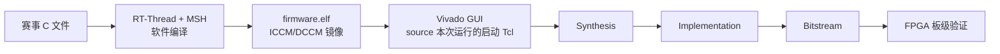

# SocRV 比赛收尾流程

这份文档对应最后几天的 PYNQ-Z2 验证，以及比赛现场的 Kintex-7 构建和烧录。
正式软件固定使用 **RT-Thread + MSH + CoreMark**：系统启动后进入 MSH，通过
`coremark [iterations]` 运行赛事程序，结束后仍能继续执行 `ps`、`help`、
`free`、`uptime` 和 `socrv_info`。裸机 CoreMark 不在这条流程中。

软件和 FPGA 分成两个清楚的阶段：

- Windows/WSL 命令行只负责依赖检查、软件编译、短仿真和 ICCM/DCCM 镜像；
- Vivado 从 Windows GUI 打开，在 Tcl Console 中设置参数并 source 建工程脚本，
  综合、实现和 bitstream 均从 Flow Navigator 分步执行。

这样既能观察 Vivado 的每一步，也能在出错时保留工程状态和日志。



## 1. 每次比赛测试使用独立目录

不再把正式结果全部堆进公共 `build/`。每次收到一版赛事源码，就建立一个带日期、
版本和用途的运行目录，例如：

```text
competition_runs/
└── 20260813_143205_coremark_r1/
    ├── source/
    │   ├── original/                  # 赛事方原始文件，禁止修改
    │   ├── source_manifest.json       # 文件名、大小和 SHA-256
    │   └── competition.json           # 源码 mode 与适配配置
    ├── software/
    │   ├── firmware.elf
    │   ├── firmware.bin
    │   ├── firmware.map
    │   ├── firmware.dis
    │   ├── size.json
    │   └── build_manifest.json
    ├── images/
    │   ├── image.json
    │   ├── code.mem
    │   ├── data.mem
    │   ├── iccm_lane0.mem ... iccm_lane3.mem
    │   └── dccm_bank0.mem ... dccm_bank7.mem
    ├── simulation/
    │   ├── result.json
    │   └── uart.log
    └── vivado/
        ├── create_pynq_z2_project.tcl       # 自动生成，直接 source
        ├── create_kintex7_project.tcl       # 自动生成，只读取 CORE_MHZ
        ├── pynq_z2-50mhz/
        │   ├── project/
        │   └── result.json
        ├── kintex7-100mhz/
        │   ├── project/
        │   └── result.json
        └── kintex7-150mhz/
            ├── project/
            └── result.json
```

`source/`、`software/`、`images/`、Vivado 工程和报告都属于同一次运行。需要比较
频率时，只增加新的 `vivado/kintex7-<频率>mhz/`，软件和镜像保持不变。

这套目录不由现场人员逐项创建。`prepare_competition_run.py` 会建立完整目录、复制
原文件、计算哈希，并生成两块板卡的 Vivado GUI 启动 Tcl。比赛 profile 使用
`--run-dir` 后，软件、镜像和仿真结果直接写入本次运行目录。

## 2. 第一步：检查环境和依赖

### Windows 环境

至少确认以下程序可用：

- Windows Python；
- Git；
- WSL；
- Vivado 2023.2；
- 板级烧录所需的 Vivado Hardware Manager/Hardware Server。

在仓库根目录执行：

```powershell
python scripts/check_environment.py --verbose
```

输出中的 `WSL toolchain` 和 `Vivado` 都应为 `PASS`。环境报告当前写入
`build/manifest/eda_env.json`；后续应让比赛软件脚本再复制一份到本次
`competition_runs/<run-id>/software/`，用于记录实际工具版本。

### WSL 工具链

环境检查会确认 WSL 中存在：

```text
verilator
make
g++
python3
git
riscv64-unknown-elf-gcc
```

`fetch_dependencies.py` 只下载仓库锁定的第三方源码，不安装 WSL、RISC-V GCC、
Verilator 或 Vivado。缺少这些程序时，需要先完成对应软件安装，再重新运行环境
检查。

### 第三方依赖

正式流程需要 RT-Thread 和 CoreMark 两项。联网时完成下载并核对锁定 commit：

```powershell
python scripts/fetch_dependencies.py --dependency rt-thread
python scripts/fetch_dependencies.py --dependency coremark
python scripts/fetch_dependencies.py --dependency rt-thread --verify
python scripts/fetch_dependencies.py --dependency coremark --verify
```

比赛前必须在断网环境再执行一次 `--verify`。不要等到现场再从 GitHub 拉取依赖。

基础工程检查可直接运行：

```powershell
python scripts/generate_soc_contract.py --check
python scripts/validate_schemas.py
python scripts/check_filelists.py
python scripts/check_memory_map.py
python -m unittest discover -s scripts/tests -v
```

这些命令不会调用 Vivado。

## 3. 第二步：放置赛事 C 程序

赛事 C 文件与当前软件各层的对应关系、完整编译源清单和计划改动见
[`competition_software_integration.md`](competition_software_integration.md)。本节只保留
现场操作步骤；实际接入前应先按该文档判断源码 mode。

准备脚本接受一个 C 文件、一个压缩包解压目录，或包含多个 `.c/.h` 的目录：

```powershell
python scripts/prepare_competition_run.py `
    --source "D:/competition_input/coremark_r1"
```

不指定 run-id 时，脚本根据时间和输入名称生成，例如：

```text
RUN_DIR=competition_runs/20260813_143205_coremark_r1
SOURCE_MODE=core_main_replacement
BUILD=python scripts/build_software.py --profile contest-rtthread-coremark --run-dir "competition_runs/20260813_143205_coremark_r1"
PYNQ_TCL=E:/.../competition_runs/20260813_143205_coremark_r1/vivado/create_pynq_z2_project.tcl
KINTEX_TCL=E:/.../competition_runs/20260813_143205_coremark_r1/vivado/create_kintex7_project.tcl
```

需要固定名称时可增加一个可选参数：

```powershell
python scripts/prepare_competition_run.py `
    --source "D:/competition_input/coremark_r1" `
    --run-id "final_coremark_r1"
```

脚本一次完成：

1. 创建 `source/software/images/simulation/vivado`；
2. 把输入原样复制到 `source/original/`；
3. 生成 `source/source_manifest.json`；
4. 生成待确认的 `source/competition.json`；
5. 生成 PYNQ 和 Kintex 的 GUI 启动 Tcl；
6. 打印后续编译命令与两个 Tcl 的完整路径。

现场只需要选择赛事方输入，不需要手动维护目录树或 PowerShell 哈希管道。
脚本优先选择名为 `core_main.c` 的文件；输入中只有一个 C 文件时，也把它当作
CoreMark 驱动。若目录中有多个 C 文件且没有唯一的 `core_main.c`，脚本会停止，
此时用 `--entry <相对路径>` 明确指定，不会自行猜测。

原文件不得覆盖 `software/coremark/upstream/`。该目录是锁定的 EEMBC CoreMark
依赖，覆盖后会破坏依赖验证，也会把赛事输入和项目适配代码混在一起。

### 赛事程序如何接入 MSH

现有 MSH 命令位于 `software/coremark/port/rtthread/command.c`。它负责：

1. 解析 `coremark [iterations]`；
2. 调用 CoreMark 主程序；
3. 读取计时结果并检查返回值；
4. 恢复 RT-Thread tick；
5. 返回 MSH，使 `ps`、`help` 等命令还能继续工作。

赛事源码不直接替换这层命令适配。现有 `contest-rtthread-coremark` profile 把赛事
文件的 `main()` 编译为 `coremark_main()`；下面其余接口继续由 SocRV CoreMark
port 提供：

```c
int coremark_main(void);
void coremark_set_iterations(uint32_t iterations);
int coremark_result_code(void);
uint64_t coremark_last_ticks(void);
void coremark_resume_interrupts(void);
```

赛事 `main()` 的重命名只存在于编译参数中，`source/original/` 内的文件不会修改。
当前实现只接受最可能的 `core_main_replacement`。若真实文件不是这一类，再按
[`competition_software_integration.md`](competition_software_integration.md) 增加
对应 adapter，不能直接套用本流程。

`contest-rtthread-coremark` 已复用现有：

- RT-Thread 内核、启动代码和 FinSH/MSH；
- UART、timer、GPIO 和 test-status BSP；
- `software/coremark/port/rtthread/command.c`；
- `-O3` 与 `rv32imf_zicsr/ilp32f` 软件约定；
- 赛事运行目录中的 C/H 文件，而不是固定的 CoreMark upstream 源文件。

## 4. 第三步 A：命令行编译软件

正式软件命令为：

```powershell
python scripts/build_software.py `
    --profile contest-rtthread-coremark `
    --run-dir "competition_runs/20260813_143205_coremark_r1"
```

该命令只做软件工作，不启动 Vivado。输出位置固定为：

```text
competition_runs/20260813_143205_coremark_r1/software/
competition_runs/20260813_143205_coremark_r1/images/
```

必须生成并检查：

- `software/firmware.elf` 的入口为 `0x00000000`；
- `software/size.json` 中 CODE 不超过 128 KiB；
- DATA+BSS 没有侵入 DATA 顶部预留的 8 KiB 栈；
- `images/image.json` 中 ELF、memory map 和各 `.mem` 哈希一致；
- 四个 ICCM lane 和八个 DCCM bank 全部存在。

赛事流程中的 IROM/DRAM，在本项目中对应 ICCM/DCCM。Vivado 读取的是
`images/` 下的十二个 bank/lane 文件，不直接读取 `firmware.bin`。

### 原 release profile 的基线命令

原 `rtthread-coremark` 仍可独立编译，用于确认比赛改造没有破坏已有软件链路：

```powershell
python scripts/build_software.py --profile rtthread-coremark
python scripts/check_images.py build/images/rtthread-coremark/image.json
```

这两条命令仍输出到 `build/`，只作为 release 基线，不参与比赛 run 归档。

### MSH 入口仿真

比赛 profile 已把三条交互设为默认值：`coremark 3`、`ps`、`help`。运行：

```powershell
python scripts/run_verilator.py `
    --profile contest-rtthread-coremark `
    --run-dir "competition_runs/20260813_143205_coremark_r1"
```

软件刚刚编译过时，可增加 `--no-software-build`；RTL 模型指纹未变化时，可增加
`--no-rtl-build`。结果写入 `simulation/result.json`，完整输出写入
`simulation/uart.log`。通过条件为：

- 出现 RT-Thread 启动信息和 `msh >`；
- `coremark 3` 完成且无 CRC、trap、timer 错误；
- CoreMark 返回后 `ps` 和 `help` 均能执行；
- 最终 test-status 为 PASS。

三轮运行远短于 CoreMark 要求的 10 秒，标准 `core_main.c` 会打印
`Must execute for at least 10 secs` 和 `Errors detected`。这不属于 CRC 失败，只用于
快速检查调用链；可计分的长运行仍以板上输出为准。

正式的长迭代运行放到 FPGA 上，不放进 RTL 仿真。

## 5. 第三步 B：在 Vivado GUI 中生成 bitstream

这一阶段不使用 `make fpga-build`，也不使用会串行跑完整流程的
`build_bitstream.tcl`。在 Vivado GUI 的 Tcl Console 中 source 本次运行目录里自动
生成的启动 Tcl，随后从 Flow Navigator 手动执行 Synthesis、Implementation 和
Generate Bitstream。启动 Tcl 内部再调用板卡原有的 `create_project.tcl`。

现有 `synth.tcl`、`impl.tcl` 和 `bitstream.tcl` 会自行 launch、wait 并关闭工程，
属于自动化批处理链路；GUI 观察模式也不 source 这三个脚本。

### PYNQ-Z2：固定 50 MHz

1. 从 Windows 启动 Vivado 2023.2。
2. 打开底部 **Tcl Console**。
3. source 准备脚本打印的 `PYNQ_TCL`：

```tcl
source {E:/Resources/03_competitions/26_03_jcs/2608round/subprj2/SocRV/competition_runs/20260813_143205_coremark_r1/vivado/create_pynq_z2_project.tcl}
```

Console 应打印：

```text
SOCRV_PROJECT=.../competition_runs/20260813_143205_coremark_r1/vivado/pynq_z2-50mhz/project
```

此时工程留在 GUI 中。依次执行：

1. **Run Synthesis**；
2. 查看 Messages、Warnings、Utilization 和综合后的 schematic；
3. **Run Implementation**；
4. 查看 Timing Summary、WNS/TNS、DRC 和布局布线；
5. **Generate Bitstream**。

PYNQ-Z2 的 Core 和外设时钟都固定为 50 MHz，不做频率扫描。

PYNQ-Z2 使用板载 Ethernet PHY 提供给 PL 的 125 MHz 时钟。当前采用
`origin/fix-reset-bug` 已验证的板级策略：MMCM 首次锁定后释放一次 SoC 复位，
后续 PHY 时钟短暂中断只暂停时钟，不重新复位 RT-Thread：

```text
125 MHz PL 时钟 → MMCM 生成 50 MHz → LOCKED
                                    → BUFGCE 开启 Core/外设时钟
                                    → 3 个 Core 时钟后仅释放一次 SoC 复位

后续 LOCKED=0 → BUFGCE 无毛刺暂停两个 SoC 时钟 → 保持寄存器/RT-Thread 状态
再次 LOCKED=1 → 两个 SoC 时钟恢复 → 从暂停位置继续执行
```

旧的“失锁立即重新复位”方案会在 H16/PHY 时钟短暂中断时反复显示 RT-Thread
启动标志，因此已移除 `pynq_z2_reset_sequencer.sv`。已有 Vivado 工程不能继续使用
旧综合结果，应重新创建工程并完整执行 Synthesis、Implementation 和 Generate
Bitstream。

PYNQ 的 `LED1` 现在直接表示实时 MMCM `LOCKED`。正常运行时应常亮；短暂时钟中断
时可能熄灭，但 `LED3` 和软件状态应保留，恢复锁定后继续运行而不是重新打印启动
标志。如果 LED1 闪烁且串口仍重新启动，再检查复位来源、异常或看门狗。

### Kintex-7：配置 Core 频率

Kintex-7 输入时钟为 200 MHz，外设时钟始终为 50 MHz。现场只设置 Core 的 MHz，
不再手填 MMCM 倍频、Core 分频、外设分频和 Hz。当前支持：

```text
100 / 125 / 150 / 200 / 250 MHz
```

下面是 150 MHz 的完整操作。第一行是唯一需要调整的参数，第二行使用准备脚本
打印的 `KINTEX_TCL`：

```tcl
set CORE_MHZ 150
source {E:/Resources/03_competitions/26_03_jcs/2608round/subprj2/SocRV/competition_runs/20260813_143205_coremark_r1/vivado/create_kintex7_project.tcl}
```

启动 Tcl 会检查 `CORE_MHZ`，根据项目内的频率表选择合法 MMCM 参数，推导
`CORE_CLOCK_HZ`，并自动使用：

```text
images/
vivado/kintex7-<CORE_MHZ>mhz/project/
```

不支持的频率会在创建工程前报错，不会生成一个时钟参数不完整的工程。工程创建后
仍从 Flow Navigator 分步运行。

`create_project.tcl` 内部使用 `create_project -force`。已经完成或准备保留的工程
不要再次 source 同一路径，否则会重建工程。需要继续查看旧结果时，直接打开：

```text
<project_dir>/socrv.xpr
```

同一个 Vivado 窗口创建下一档频率前，先关闭当前工程，或者为每个频率启动一个
新的 Vivado 窗口。每次创建 Kintex 工程只重新设置 `CORE_MHZ`，不依赖上一次
Tcl Console 中残留的内部 MMCM 参数。

软件镜像更新后也不能沿用旧综合结果。最稳妥的做法是新建 run-id；确需复用工程
时，在 GUI 中 Reset Synthesis Run，再重新执行后续步骤。

## 6. 保存报告和确认结果位置

GUI 完成综合后，可在 Tcl Console 保存综合报告：

```tcl
set report_dir [file join [get_property DIRECTORY [current_project]] reports]
file mkdir $report_dir
open_run synth_1
report_utilization -hierarchical -file [file join $report_dir post_synth_utilization.rpt]
report_timing_summary -file [file join $report_dir post_synth_timing_summary.rpt]
report_clock_utilization -file [file join $report_dir post_synth_clock_utilization.rpt]
report_cdc -file [file join $report_dir post_synth_cdc.rpt]
```

实现完成后保存签核报告：

```tcl
set report_dir [file join [get_property DIRECTORY [current_project]] reports]
file mkdir $report_dir
open_run impl_1
report_utilization -hierarchical -file [file join $report_dir post_impl_utilization.rpt]
report_timing_summary -file [file join $report_dir post_impl_timing_summary.rpt]
report_timing -delay_type max -max_paths 20 -nworst 5 \
    -path_type full_clock_expanded -input_pins \
    -file [file join $report_dir post_impl_timing_paths.rpt]
report_drc -file [file join $report_dir post_impl_drc.rpt]
report_methodology -file [file join $report_dir post_impl_methodology.rpt]
```

以 Kintex-7 150 MHz 为例，关键文件位于：

| 内容 | 位置 |
| --- | --- |
| Vivado 工程 | `competition_runs/<run-id>/vivado/kintex7-150mhz/project/socrv.xpr` |
| 综合日志 | `.../project/socrv.runs/synth_1/runme.log` |
| 实现日志 | `.../project/socrv.runs/impl_1/runme.log` |
| 报告 | `.../project/reports/` |
| bitstream | `.../project/socrv.runs/impl_1/fpga_top.bit` |
| Vivado 主日志 | `.../project/vivado.log` 或 Vivado 当前工作目录下的 `vivado.log` |

生成 bitstream 并保存报告后，在 Windows 命令行做一次只读检查：

```powershell
python scripts/check_fpga_reports.py `
    --board kintex7_competition `
    --core-mhz 150 `
    --run-dir "competition_runs/20260813_143205_coremark_r1"
```

该命令不启动 Vivado，只读取现有 `.bit`、timing 和 DRC 报告，并在
`vivado/kintex7-150mhz/result.json` 写入 WNS/TNS、DRC 数量和 bitstream SHA-256。
PYNQ 对应使用 `--board pynq_z2 --core-mhz 50`。

签核至少满足：

- `timing_met=true`；
- `drc_error_count=0`；
- bitstream 路径和 SHA-256 已记录；
- GUI 中确认实际 part、约束和 Core 频率正确。

需要生成只包含本次输入、软件、镜像、仿真记录、bitstream 和签核报告的压缩包时，
执行：

```powershell
python scripts/package_release.py `
    --run-dir "competition_runs/20260813_143205_coremark_r1" `
    --board kintex7_competition `
    --core-mhz 150
```

结果位于 `competition_runs/<run-id>/release/`，压缩包内另有逐文件 SHA-256
`manifest.json`。

## 7. 第四步：烧录和板级交互

烧录使用 Vivado Hardware Manager GUI，选择本次运行目录中的：

```text
competition_runs/<run-id>/vivado/<board>-<freq>/project/
    socrv.runs/impl_1/fpga_top.bit
```

不要从公共 `build/`、Downloads 或上一次运行目录选择同名 `fpga_top.bit`。烧录前
可在 PowerShell 中执行 `Get-FileHash`，与对应 `result.json` 核对。

串口工具和具体交互操作不在本文展开。板级验收应覆盖以下行为：

```text
RT-Thread 启动
msh >
help
ps
free
uptime
socrv_info
coremark 3
ps
help
coremark 10000
```

PYNQ 烧录后先观察 `LED1`：它应在复位稳定窗口结束后常亮。打开串口时建议先让
终端开始记录，再 Program Device；正常情况下只应出现一轮 RT-Thread 启动信息，
随后停在 `msh >`。若重复打印启动标志，同时记录 `LED1` 是否闪烁：闪烁说明时钟
稳定资格丢失；始终常亮则应转查 CPU 异常、跳回复位向量或内存破坏。

`coremark 3` 之后再次执行 `ps` 和 `help` 很重要：它能确认 CoreMark 为性能计时
暂停中断后，RT-Thread tick 已恢复，MSH 没有因为一次基准运行而失效。

## 8. PYNQ 赛前与 Kintex 现场顺序

### 最后几天的 PYNQ 流程

1. 准备依赖并通过环境检查；
2. 用 `rtthread-coremark` 基线跑短仿真；
3. 对赛事输入运行一次 `prepare_competition_run.py`，自动建立并登记 run；
4. 把赛事程序接入 `contest-rtthread-coremark`；
5. 编译软件并将产物写入同一个 run-id；
6. 在 Vivado GUI source 本次 run 自动生成的 PYNQ 启动 Tcl；
7. 手动完成 Synthesis、Implementation 和 Generate Bitstream；
8. 保存报告，运行 `check_fpga_reports.py`；
9. 烧录 PYNQ，确认 `LED1` 延迟点亮后保持稳定且 RT-Thread 只启动一次；
10. 通过串口验证 RT-Thread、MSH、CoreMark 和后续命令。

PYNQ 只证明软件、存储器初始化、UART、复位和板级数据通路。它固定 50 MHz，
不能代替 Kintex-7 的 timing 或超频结论。

### 比赛现场的 Kintex 流程

1. 对赛事输入运行一次准备脚本，由脚本生成正式 run-id、保存原文件并记录哈希；
2. 编译 `contest-rtthread-coremark`，完成短仿真；
3. 先在 GUI 创建 100 MHz 工程并得到稳定 bitstream；
4. 再按 `125 → 150 → 200 → 250 MHz` 建立独立工程；
5. 每档保存 timing、DRC、bitstream 和 `result.json`；
6. 只烧录 timing 通过、DRC error 为 0 且板上连续运行稳定的频率。

每个频率都使用独立目录，不覆盖上一档。某档失败时直接回退到最近的稳定版本。

## 9. 当前实现状态

以下部分已经完成：

- `core_main_replacement` 源码准备、原文件复制和 SHA-256；
- `contest-rtthread-coremark` 软件 profile；
- `--run-dir` 软件、镜像和仿真归档；
- `coremark 3 → ps → help` 短仿真门禁；
- PYNQ 固定 50 MHz 和 Kintex 单一 `CORE_MHZ` GUI Tcl；
- PYNQ 首次 MMCM 锁定后只释放一次 SoC 复位，后续失锁通过 BUFGCE 暂停时钟而不重启 RT-Thread；
- FPGA 报告检查与比赛 run 打包。

实现没有修改 CoreMark 和 RT-Thread upstream，也没有改变两块板的传感器引脚
约束。PYNQ-Z2 板级 RTL 使用 BUFGCE 掉锁暂停与一次性启动复位；两块板的
`create_project.tcl` 同步采用修复分支的 include 目录处理。当前边界是只支持
“赛事文件职责等同 `core_main.c`”这一种输入。
真实文件若包含多份算法实现、平台 port 或自包含 `main()`，先改
`competition.json` 的 mode 并补专用 adapter，不能把未知源文件自动并入固件。
