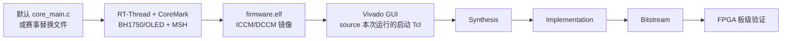
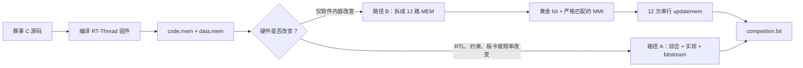

# SocRV 三合一基线与比赛构建流程

本项目的正式基线固定为 **RT-Thread + CoreMark + 传感器**，缺少其中任何一项都
不能作为 PYNQ-Z2 或 Kintex-7 的发布镜像。系统启动后进入串口 MSH，至少应包含：

```text
coremark
light_read
oled_start
oled_stop
```

默认测评入口使用仓库当前锁定的
`software/coremark/upstream/core_main.c`。`light_read`、`oled_start` 和
`oled_stop` 来自同一份 RT-Thread 固件，不另外烧录传感器程序。裸机 CoreMark、
纯 RT-Thread profile 和不含传感器命令的旧镜像均不属于这条基线。

软件和 FPGA 分成两个清楚的阶段：

- Windows/WSL 命令行只负责依赖检查、软件编译、短仿真和 ICCM/DCCM 镜像；
- 赛前生成黄金实现时，Vivado 从 Windows GUI 打开，在 Tcl Console 中设置参数并
  source 建工程脚本，综合、实现和 bitstream 均从 Flow Navigator 分步执行；
- 赛时只有软件变化时，使用黄金 bit/MMI 和 `updatemem` 生成新 bit，不重新综合、
  布局或布线。

这样既能观察 Vivado 的每一步，也能在出错时保留工程状态和日志。



## 1. 基线合同与运行目录

默认基线使用以下设置：

| 项目 | 固定值 |
| --- | --- |
| RTOS | RT-Thread + FinSH/MSH |
| 默认测评文件 | `software/coremark/upstream/core_main.c` |
| 归档编译 profile | `contest-rtthread-coremark` |
| 本地快速编译 profile | `rtthread-coremark` |
| 传感器命令 | `light_read`、`oled_start`、`oled_stop` |
| CoreMark 命令 | `coremark [iterations]` |
| 串口 | 115200 baud，8N1 |

`contest-rtthread-coremark` 和 `rtthread-coremark` 都复用
`software/profiles/rtthread_sources.inc`，其中已经列入 I²C、BH1750、OLED 驱动和
`cmd_sensors.c`。二者的差别只是 CoreMark 入口来源及产物是否写入独立 run。

正式构建每次使用一个新的 `<run-id>`，例如
`baseline_coremark_rtos_sensors_20260814_01`。禁止手工新建一个空的
`competition_runs/release` 再把它传给 `--run-dir`；`--run-dir` 必须由
`prepare_competition_run.py` 创建，目录中应先存在 `source/competition.json` 和
`vivado/create_pynq_z2_project.tcl`。

不再把正式结果全部堆进公共 `build/`。每次收到一版赛事源码，就建立一个带日期、
版本和用途的运行目录，例如：

```text
competition_runs/
└── <run-id>/
    ├── source/
    │   ├── original/                  # 赛事方原始文件，禁止修改
    │   ├── source_manifest.json       # 文件名、大小和 SHA-256
    │   └── competition.json           # 源码 mode 与适配配置
    ├── software/
    │   ├── firmware.elf
    │   ├── firmware.bin
    │   ├── firmware.map
    │   ├── firmware.dis
    │   ├── size.json
    │   └── build_manifest.json
    ├── images/
    │   ├── image.json
    │   ├── code.mem
    │   ├── data.mem
    │   ├── iccm_lane0.mem ... iccm_lane3.mem
    │   └── dccm_bank0.mem ... dccm_bank7.mem
    ├── simulation/
    │   ├── result.json
    │   └── uart.log
    ├── patched/
    │   ├── competition.bit
    │   ├── patch_result.json
    │   └── work/                       # 12 路 MEM、stage bit 和逐步日志
    └── vivado/
        ├── create_pynq_z2_project.tcl       # 自动生成，直接 source
        ├── create_kintex7_project.tcl       # 自动生成，只读取 CORE_MHZ
        ├── pynq_z2-50mhz/
        │   ├── project/
        │   └── result.json
        ├── kintex7-100mhz/
        │   ├── project/
        │   └── result.json
        └── kintex7-150mhz/
            ├── project/
            └── result.json
```

`source/`、`software/`、`images/`、Vivado 工程和报告都属于同一次运行。需要比较
频率时，只增加新的 `vivado/kintex7-<频率>mhz/`，软件和镜像保持不变。

这套目录不由现场人员逐项创建。`prepare_competition_run.py` 会建立完整目录、复制
原文件、计算哈希，并生成两块板卡的 Vivado GUI 启动 Tcl。脚本若报告目录已经
存在，应换一个新的 run-id，不要修改目录权限，也不要在未准备的目录中直接运行
`build_software.py`。

## 2. 第一步：检查环境和依赖

### Windows 环境

至少确认以下程序可用：

- Windows Python；
- Git；
- WSL；
- Vivado 2023.2；
- 板级烧录所需的 Vivado Hardware Manager/Hardware Server。

在仓库根目录执行：

```powershell
python scripts/check_environment.py --verbose
```

输出中的 `WSL toolchain` 和 `Vivado` 都应为 `PASS`。环境报告当前写入
`build/manifest/eda_env.json`；后续应让比赛软件脚本再复制一份到本次
`competition_runs/<run-id>/software/`，用于记录实际工具版本。

### WSL 工具链

环境检查会确认 WSL 中存在：

```text
verilator
make
g++
python3
git
riscv64-unknown-elf-gcc
```

`fetch_dependencies.py` 只下载仓库锁定的第三方源码，不安装 WSL、RISC-V GCC、
Verilator 或 Vivado。缺少这些程序时，需要先完成对应软件安装，再重新运行环境
检查。

### 第三方依赖

正式流程需要 RT-Thread 和 CoreMark 两项。联网时完成下载并核对锁定 commit：

```powershell
python scripts/fetch_dependencies.py --dependency rt-thread
python scripts/fetch_dependencies.py --dependency coremark
python scripts/fetch_dependencies.py --dependency rt-thread --verify
python scripts/fetch_dependencies.py --dependency coremark --verify
```

比赛前必须在断网环境再执行一次 `--verify`。不要等到现场再从 GitHub 拉取依赖。

基础工程检查可直接运行：

```powershell
python scripts/generate_soc_contract.py --check
python scripts/validate_schemas.py
python scripts/check_filelists.py
python scripts/check_memory_map.py
python -m unittest discover -s scripts/tests -v
```

这些命令不会调用 Vivado。

## 3. 第二步：准备默认基线 run

默认输入就是仓库中的 `software/coremark/upstream/core_main.c`。以下命令在仓库
根目录执行；`$runId` 每次使用新名称：

```powershell
$ErrorActionPreference = "Stop"
$runId = "baseline_coremark_rtos_sensors_20260814_01"
$runDir = "competition_runs/$runId"
$coremarkSource = "software/coremark/upstream/core_main.c"

if (Test-Path -LiteralPath $runDir) {
    throw "run 已存在，请修改 `$runId，不要复用或手工改权限：$runDir"
}

python scripts/prepare_competition_run.py `
    --source $coremarkSource `
    --run-id $runId
```

准备成功后，控制台会打印 `RUN_DIR`、`BUILD`、`PYNQ_TCL` 和 `KINTEX_TCL`。立即
检查关键文件是否存在且确实可读，并打印可直接粘贴到 Vivado Tcl Console 的完整
命令：

```powershell
$requiredRunFiles = @(
    "$runDir/source/competition.json",
    "$runDir/vivado/create_pynq_z2_project.tcl",
    "$runDir/vivado/create_kintex7_project.tcl"
)

$requiredRunFiles | ForEach-Object {
    if (-not (Test-Path -LiteralPath $_ -PathType Leaf)) {
        throw "run 文件不存在：$_"
    }
    $null = Get-Content -LiteralPath $_ -TotalCount 1 -ErrorAction Stop
}

$pynqTcl = (Resolve-Path -LiteralPath $requiredRunFiles[1]).Path.Replace("\", "/")
$kintexTcl = (Resolve-Path -LiteralPath $requiredRunFiles[2]).Path.Replace("\", "/")

Write-Host "PYNQ_SOURCE=source {$pynqTcl}"
Write-Host "KINTEX_SOURCE=source {$kintexTcl}"
```

上述检查没有抛出错误才可继续。把 `PYNQ_SOURCE=` 或 `KINTEX_SOURCE=` 后面的整条
命令复制到 Vivado，不再手工拼接 run 路径。若出现 `Access denied`、
`Permission denied` 或“文件不存在”，应回到这里创建一个全新的 run-id；不要对旧
目录改权限，也不要进入 Vivado 后反复 source。

准备脚本会复制默认 `core_main.c`、记录 SHA-256、生成 `competition.json` 和两块板
的 Vivado 启动 Tcl。默认文件本身仍留在 `software/coremark/upstream/`，不得手工
覆盖或修改。需要确认默认输入时执行：

```powershell
Get-FileHash -Algorithm SHA256 $coremarkSource
Get-FileHash -Algorithm SHA256 "$runDir/source/original/core_main.c"
```

两个哈希应一致。

以后收到赛事方替换文件时，只改 `--source` 和 `$runId`：

```powershell
$runId = "contest_coremark_r1_20260814_01"
$runDir = "competition_runs/$runId"

python scripts/prepare_competition_run.py `
    --source "D:/competition_input/coremark_r1" `
    --run-id $runId
```

若输入目录中有多个 C 文件且没有唯一的 `core_main.c`，使用
`--entry <相对路径>` 明确入口。源码类型和适配限制见
[`competition_software_integration.md`](competition_software_integration.md)。

### CoreMark 和传感器如何进入同一份 MSH

现有 MSH 命令位于 `software/coremark/port/rtthread/command.c`。它负责：

1. 解析 `coremark [iterations]`；
2. 调用 CoreMark 主程序；
3. 读取计时结果并检查返回值；
4. 恢复 RT-Thread tick；
5. 返回 MSH，使 `ps`、`help` 等命令还能继续工作。

传感器命令位于 `software/applications/rtthread/commands/cmd_sensors.c`，驱动来自
`software/bsp/drivers/drv_i2c.c`、`drv_bh1750.c` 和 `drv_oled.c`。这些文件由
`rtthread_sources.inc` 固定加入，不需要额外 profile 或第二份固件。

测评源码不直接替换 MSH 适配层。`contest-rtthread-coremark` 把选定文件的 `main()`
编译为 `coremark_main()`；下面其余接口继续由 SocRV CoreMark port 提供：

```c
int coremark_main(void);
void coremark_set_iterations(uint32_t iterations);
int coremark_result_code(void);
uint64_t coremark_last_ticks(void);
void coremark_resume_interrupts(void);
```

赛事 `main()` 的重命名只存在于编译参数中，`source/original/` 内的文件不会修改。
当前实现只接受最可能的 `core_main_replacement`。若真实文件不是这一类，再按
[`competition_software_integration.md`](competition_software_integration.md) 增加
对应 adapter，不能直接套用本流程。

`contest-rtthread-coremark` 复用现有：

- RT-Thread 内核、启动代码和 FinSH/MSH；
- UART、timer、GPIO、I²C、BH1750、OLED 和 test-status BSP；
- `software/coremark/port/rtthread/command.c`；
- `-O3` 与 `rv32imf_zicsr/ilp32f` 软件约定；
- run 目录中的测评入口文件。默认 run 的入口副本来自当前仓库的
  `software/coremark/upstream/core_main.c`。

## 4. 第三步 A：编译三合一软件

沿用第 3 节 PowerShell 窗口中的 `$runDir`。如果已经关闭过 PowerShell，先重新设置
这两个变量，不要对同一个 run-id 再执行 `prepare_competition_run.py`：

```powershell
$runId = "baseline_coremark_rtos_sensors_20260814_01"  # 改成第 3 节实际使用的值
$runDir = "competition_runs/$runId"
```

然后执行：

```powershell
python scripts/build_software.py `
    --profile contest-rtthread-coremark `
    --run-dir $runDir
```

该命令只做软件工作，不启动 Vivado。输出位置固定为：

```text
$runDir/software/
$runDir/images/
```

必须生成并检查：

- `software/firmware.elf` 的入口为 `0x00000000`；
- `software/size.json` 中 CODE 不超过 128 KiB；
- DATA+BSS 没有侵入 DATA 顶部预留的 8 KiB 栈；
- `images/image.json` 中 ELF、memory map 和各 `.mem` 哈希一致；
- 四个 ICCM lane 和八个 DCCM bank 全部存在。

随后检查 CoreMark 和三条传感器命令是否同时进入 ELF：

```powershell
$requiredSymbols = @(
    "__fsym_coremark",
    "__fsym_light_read",
    "__fsym_oled_start",
    "__fsym_oled_stop"
)

$mapText = Get-Content -LiteralPath "$runDir/software/firmware.map" -Raw
$requiredSymbols | ForEach-Object {
    if ($mapText -notmatch [regex]::Escape($_)) {
        throw "基线缺少 MSH 符号：$_"
    }
}

python scripts/check_images.py "$runDir/images/image.json"
```

这一步通过后，run 才满足“RT-Thread + CoreMark + 传感器”的软件基线。

赛事流程中的 IROM/DRAM，在本项目中对应 ICCM/DCCM。Vivado 读取的是
`images/` 下的十二个 bank/lane 文件，不直接读取 `firmware.bin`。

### 不归档的本地快速编译

只想快速确认当前仓库能编译时，可以使用内置 profile：

```powershell
python scripts/build_software.py --profile rtthread-coremark
python scripts/check_images.py build/images/rtthread-coremark/image.json
```

它同样包含 RT-Thread、CoreMark 和传感器命令，但产物写在 `build/`，不会生成
run 专用的 Vivado 启动 Tcl。正式 GUI 构建继续使用前面的 `$runDir`。

不要执行省略 profile 的 `make fpga-build BOARD=pynq_z2`；当前 PYNQ 默认 profile
是纯 `rtthread`，不满足三合一基线。必须显式使用 `rtthread-coremark`，或使用本文
的归档 run 流程。

### MSH 入口仿真

比赛 profile 已把三条交互设为默认值：`coremark 3`、`ps`、`help`。运行：

```powershell
python scripts/run_verilator.py `
    --profile contest-rtthread-coremark `
    --run-dir $runDir
```

软件刚刚编译过时，可增加 `--no-software-build`；RTL 模型指纹未变化时，可增加
`--no-rtl-build`。结果写入 `simulation/result.json`，完整输出写入
`simulation/uart.log`。通过条件为：

- 出现 RT-Thread 启动信息和 `msh >`；
- `coremark 3` 完成且无 CRC、trap、timer 错误；
- CoreMark 返回后 `ps` 和 `help` 均能执行，`help` 中存在 `coremark`、
  `light_read`、`oled_start` 和 `oled_stop`；
- 最终 test-status 为 PASS。

三轮运行远短于 CoreMark 要求的 10 秒，标准 `core_main.c` 会打印
`Must execute for at least 10 secs` 和 `Errors detected`。这不属于 CRC 失败，只用于
快速检查调用链；可计分的长运行仍以板上输出为准。

正式的长迭代运行放到 FPGA 上，不放进 RTL 仿真。

## 5. 第三步 B：选择 bitstream 生成路径

软件编译完成并得到 `images/code.mem` 和 `images/data.mem` 后，有两条互斥路径：



- **路径 A**是原有完整流程，用于硬件发生变化，或尚无经过验收的黄金包时。
- **路径 B**是正式赛时优先流程，只修改既有 bitstream 中 48 个 BRAM 的初始化值，
  不运行综合、布局或布线。

路径 B 并不取消路径 A。赛前仍必须用路径 A 生成并实板验收一次黄金实现；赛时只有
程序变化时，才从这份只读黄金实现快速生成新 bitstream。

### 5.1 路径 A：在 Vivado GUI 中完整生成 bitstream

这一阶段不使用 `make fpga-build`，也不使用会串行跑完整流程的
`build_bitstream.tcl`。在 Vivado GUI 的 Tcl Console 中 source 本次运行目录里自动
生成的启动 Tcl，随后从 Flow Navigator 手动执行 Synthesis、Implementation 和
Generate Bitstream。启动 Tcl 内部再调用板卡原有的 `create_project.tcl`。

必须使用第 3 节准备脚本打印的实际 `PYNQ_TCL`/`KINTEX_TCL`。不要凭记忆输入
`competition_runs/release/...`，也不要复制本文中过期的时间戳目录。

启动 Tcl 不会替你编译软件。只有第 4 节构建完成、四个 MSH 符号检查通过，并且
本次 run 的 `images/` 已生成后，才可 source。板级工程始终包含 I²C RTL 和传感器
引脚；RT-Thread、CoreMark 与传感器命令则来自同一个 run 的软件镜像，二者缺一
不可。

现有 `synth.tcl`、`impl.tcl` 和 `bitstream.tcl` 会自行 launch、wait 并关闭工程，
属于自动化批处理链路；GUI 观察模式也不 source 这三个脚本。

### PYNQ-Z2：固定 50 MHz

1. 从 Windows 启动 Vivado 2023.2。
2. 打开底部 **Tcl Console**。
3. 原样粘贴第 3 节 PowerShell 输出中 `PYNQ_SOURCE=` 后面的完整命令。

这条命令已经包含本次 run 的绝对路径。不要改成 `competition_runs/release`，也不要
手工输入 run-id 或旧时间戳目录。

Console 应打印：

```text
SOCRV_PROJECT=.../competition_runs/<run-id>/vivado/pynq_z2-50mhz/project
```

此时工程留在 GUI 中。依次执行：

1. **Run Synthesis**；
2. 查看 Messages、Warnings、Utilization 和综合后的 schematic；
3. **Run Implementation**；
4. 查看 Timing Summary、WNS/TNS、DRC 和布局布线；
5. **Generate Bitstream**。

PYNQ-Z2 的 Core 和外设时钟都固定为 50 MHz，不做频率扫描。

PYNQ-Z2 使用板载 Ethernet PHY 提供给 PL 的 125 MHz 时钟。当前采用
`origin/fix-reset-bug` 已验证的板级策略：MMCM 首次锁定后释放一次 SoC 复位，
后续 PHY 时钟短暂中断只暂停时钟，不重新复位 RT-Thread：

```text
125 MHz PL 时钟 → MMCM 生成 50 MHz → LOCKED
                                    → BUFGCE 开启 Core/外设时钟
                                    → 3 个 Core 时钟后仅释放一次 SoC 复位

后续 LOCKED=0 → BUFGCE 无毛刺暂停两个 SoC 时钟 → 保持寄存器/RT-Thread 状态
再次 LOCKED=1 → 两个 SoC 时钟恢复 → 从暂停位置继续执行
```

旧的“失锁立即重新复位”方案会在 H16/PHY 时钟短暂中断时反复显示 RT-Thread
启动标志，因此已移除 `pynq_z2_reset_sequencer.sv`。已有 Vivado 工程不能继续使用
旧综合结果，应重新创建工程并完整执行 Synthesis、Implementation 和 Generate
Bitstream。

PYNQ 的 `LED1` 现在直接表示实时 MMCM `LOCKED`。正常运行时应常亮；短暂时钟中断
时可能熄灭，但 `LED3` 和软件状态应保留，恢复锁定后继续运行而不是重新打印启动
标志。如果 LED1 闪烁且串口仍重新启动，再检查复位来源、异常或看门狗。

### Kintex-7：配置 Core 频率

Kintex-7 输入时钟为 200 MHz，外设时钟始终为 50 MHz。现场只设置 Core 的 MHz，
不再手填 MMCM 倍频、Core 分频、外设分频和 Hz。当前支持：

```text
100 / 125 / 150 / 200 / 250 MHz
```

下面是 150 MHz 的完整操作。先设置频率，再粘贴第 3 节 PowerShell 输出中
`KINTEX_SOURCE=` 后面的完整命令；它与 PYNQ 使用同一个 run：

```tcl
set CORE_MHZ 150
```

设置频率后，原样粘贴 `KINTEX_SOURCE=` 后面的 `source {...}` 命令。要测试其他
档位时，仅修改 `CORE_MHZ`；不要改 Tcl 路径中的 run-id。

启动 Tcl 会检查 `CORE_MHZ`，根据项目内的频率表选择合法 MMCM 参数，推导
`CORE_CLOCK_HZ`，并自动使用：

```text
images/
vivado/kintex7-<CORE_MHZ>mhz/project/
```

不支持的频率会在创建工程前报错，不会生成一个时钟参数不完整的工程。工程创建后
仍从 Flow Navigator 分步运行。

`create_project.tcl` 内部使用 `create_project -force`。已经完成或准备保留的工程
不要再次 source 同一路径，否则会重建工程。需要继续查看旧结果时，直接打开：

```text
<project_dir>/socrv.xpr
```

同一个 Vivado 窗口创建下一档频率前，先关闭当前工程，或者为每个频率启动一个
新的 Vivado 窗口。每次创建 Kintex 工程只重新设置 `CORE_MHZ`，不依赖上一次
Tcl Console 中残留的内部 MMCM 参数。

如果选择本节的完整路径，软件镜像更新后不能沿用旧综合结果。最稳妥的做法是新建
run-id；确需复用工程时，在 GUI 中 Reset Synthesis Run，再重新执行后续步骤。
如果硬件完全不变且已有匹配并验收过的黄金包，则改用下一节的快速路径。

### 5.2 路径 B：不重新布局布线，直接替换 code.mem/data.mem

#### 5.2.1 适用条件和不会发生的事情

快速路径只适用于以下内容全部不变的情况：

- FPGA 板卡和器件；
- RTL、参数、约束、时钟频率和 Vivado 版本；
- ICCM/DCCM 的深度、宽度、交织方式和物理 BRAM 布局；
- RT-Thread 固件的链接地址和内存布局。

`updatemem` 只改 BRAM 的 `INIT/INITP` 配置内容。它不修改网表、BRAM LOC、连线或
时钟，不调用 `synth_design`、`place_design` 或 `route_design`，所以不会改变黄金
实现已经签核的静态时序路径。新程序本身仍可能暴露原来没有执行到的软件或硬件问题，
因此生成后仍要做串口和板级功能检查。

只要板卡、频率、RTL、约束或存储结构有任何变化，就必须回到路径 A。PYNQ-Z2 与
Kintex-7 的 bit、MMI 和 DCP 绝对不能混用；不同频率或不同实现 run 的文件也不能
拼装使用。

#### 5.2.2 赛前必须准备的黄金包

每套黄金包至少包含：

```text
golden/<board>-<profile>-<frequency>-<git-commit>/
├── golden.bit
├── golden.mmi
├── golden_postroute.dcp
├── bram_map.tsv
├── mmi_validation.json
├── result.json
├── reports/
├── original_image/
│   ├── firmware.elf
│   ├── image.json
│   ├── code.mem
│   ├── data.mem
│   ├── iccm_lane0.mem ... iccm_lane3.mem
│   └── dccm_bank0.mem ... dccm_bank7.mem
└── sha256.txt
```

`golden.bit`、`golden.mmi`、`golden_postroute.dcp` 和 `bram_map.tsv` 必须来自同一次
实现。黄金 bit 设为只读，赛时永远写到新的工作目录，不原地覆盖。赛前至少完成：

1. WNS 不小于 0、TNS 为 0，DRC 没有未批准的 error；
2. MMI 中 4 个 ICCM lane 和 8 个 DCCM bank 恰好覆盖全部 48 个 RAMB36，不能遗漏
   或重复 LOC；
3. 用 `original_image/` 中的原 MEM 回填并启动，行为与未修改的黄金 bit 一致；
4. 再回填一份特征明显的不同 RT-Thread 程序并上板启动；
5. 记录所有文件 SHA-256、Git commit、板卡、器件、频率和 Vivado 版本。

当前工程的 RAM 仍是 RTL 推断 RAM，不要求为了快速更新改成 XPM。已验证的手工 MMI
应使用 Vivado `MemoryArray/MemoryLayout/BRAM` 结构，并按 routed DCP 的真实 LOC 和
`BitLayout` 生成；特别是 DCCM 的两个物理切片为 `p2_d16` 与 `p0_d14`，不能把它
们简单写成普通的 16+16 `Processor/BitLane`。

#### 5.2.3 为什么不能把两个文件直接各调用一次 updatemem

项目的两个规范镜像需要先按地址交织拆开：

```text
code.mem：32768 个 32-bit word
  word_index = flat_index
  lane = word_index % 4
  row  = word_index // 4
  → 4 × 8192 word：iccm_lane0.mem ... iccm_lane3.mem

data.mem：16384 个 32-bit word
  word_index = flat_index
  bank = word_index % 8
  row  = word_index // 8
  → 8 × 2048 word：dccm_bank0.mem ... dccm_bank7.mem
```

因此 `code.mem` 和 `data.mem` 是赛时脚本的两个输入，但不是两个可直接更新的物理
地址空间。脚本必须先产生 12 个临时 lane/bank 文件，再对同一个 bit 串行执行 12 次
`updatemem`。Vivado 2023.2 的 `updatemem` 还要求每个临时 MEM 含地址起点：

```text
@00000000
30047073
...
```

工程生成的原始 MEM 不需要修改；快速替换脚本应只在临时目录自动补这一行。

#### 5.2.4 现场实际操作

先按第 3、4 节完成赛事源码接入和软件编译。确认本次 run 中存在：

```text
competition_runs/<run-id>/images/code.mem
competition_runs/<run-id>/images/data.mem
```

统一入口按以下形式使用：

```powershell
$goldenDir = "golden/kintex7-rtthread-coremark-150mhz-<commit>"

python scripts/patch_bitstream.py `
  --golden-dir $goldenDir `
  --code-mem "$runDir/images/code.mem" `
  --data-mem "$runDir/images/data.mem" `
  --output-dir "$runDir/patched"
```

预期输出为：

```text
competition_runs/<run-id>/patched/
├── competition.bit
├── patch_result.json
└── work/
    ├── iccm_lane0.mem ... iccm_lane3.mem
    ├── dccm_bank0.mem ... dccm_bank7.mem
    ├── stage-01.bit ... stage-12.bit
    └── stage-01.log ... stage-12.log
```

`scripts/patch_bitstream.py` 已完成 PYNQ-Z2 黄金包的 12 路自回填和不同软件镜像
替换测试。每次运行仍必须按下面的过程核查，不得因为脚本退出码为 0 就省略验收：

1. 校验黄金 bit/MMI 的 SHA-256 和目标 FPGA part；
2. 严格检查 `code.mem` 为 32768 行、`data.mem` 为 16384 行，每行恰好 8 个十六进制
   字符；
3. 按上述公式拆成 4+8 个文件，并在临时副本首行添加 `@00000000`；
4. 从只读 `golden.bit` 开始更新 `ICCM_LANE0`；
5. 每一步以上一步的 stage bit 为输入，依次更新剩余 3 个 lane 和 8 个 bank；
6. 第 12 步成功后才复制为 `competition.bit`；
7. 保存输入、黄金文件、最终 bit 的 SHA-256 及每一步日志。

单步命令的等价形式为：

```powershell
$updatemem = Join-Path $env:XILINX_VIVADO "bin/updatemem.bat"

& $updatemem `
  --force `
  --meminfo "<golden-dir>\golden.mmi" `
  --data "<work-dir>\iccm_lane0.mem" `
  --bit "<golden-dir>\golden.bit" `
  --proc "ICCM_LANE0" `
  --out "<work-dir>\stage-01.bit"
```

后续步骤把 `--bit` 改为前一步输出，并把 `--data`、`--proc` 和 `--out` 改成当前
lane/bank。`--proc` 名称必须从当前黄金 MMI 精确读取，不能照抄另一套黄金包。

#### 5.2.5 必须使用严格的失败判定

Windows 下已经观察到 `updatemem` 内部报告失败时进程退出码仍可能是 0。因此每一步
必须同时满足以下条件，不能只检查 `$LASTEXITCODE`：

- 日志不含 `ERROR:`；
- 日志不含 `update_mem failed`；
- 日志不含 `Abnormal program termination`；
- 输出 stage bit 存在；
- 输出大小与黄金 bit 相同或符合黄金包中记录的精确期望；
- 日志明确出现 `update_mem completed successfully`。

任一步失败都立即停止，删除本次不完整的 stage 输出，并从只读 `golden.bit` 重新
开始；不能从失败步骤留下的 bit 接着更新。

#### 5.2.6 下载前验收和回退

下载 `competition.bit` 前检查 `patch_result.json` 中的黄金包身份、12 个步骤和 SHA-256。
上板后至少确认：

```text
RT-Thread 启动
msh >
help
ps
competition（或比赛规定的 MSH 命令）
ps
```

若出现非法指令、无串口、数据异常或 MSH 无法返回，立即重新下载未修改的
`golden.bit`。先检查 MEM 行数、lane/bank 顺序、MMI/bit 是否配套以及 12 步是否完整，
不要在赛时启动重新综合实现。

#### 5.2.7 已完成的 PYNQ-Z2 不同软件镜像替换验证

2026-08-14 使用以下已上板验证的黄金实现进行 A/B 镜像测试：

```text
板卡/器件：PYNQ-Z2 / xc7z020clg400-1
频率：50 MHz
Git commit：3fce8d8eec5fd948ce3a9176a5e1033a4757d82c
黄金目录：golden/pynq_z2-rtthread-coremark-50mhz-3fce8d8
golden.bit SHA-256：e1a17c77723088f2e206b275712294ae40661990e4232b6f6519ade6f1dd0064
golden.mmi SHA-256：417494e7f197f58a26c5a673e01540f2b0e53e7db4981c07c64b98a374760510
```

这套 `3fce8d8` 黄金包早于 BH1750/OLED 板级 RTL 合入，只能证明 PYNQ 的
`updatemem` 替换链路，不能作为当前“三合一基线”的正式黄金包。正式基线必须从
包含传感器 I²C RTL、一次性复位修复和最终时钟配置的当前硬件版本重新完整实现，
再导出配套 bit、MMI、routed DCP 和 BRAM 映射并完成实板 A/B 验收。仅把带传感器
命令的软件写入旧黄金 bit，不会凭空增加旧硬件中不存在的 I²C 外设。

验证软件保留 RT-Thread、MSH 和 CoreMark，另外增加：

```text
hello       -> Hello, world!
plus 7 35   -> 7 + 35 = 42
```

为避免改动已用于比赛的 `rtthread-coremark` 基线，测试放在 detached worktree
`tmp/quickpatch-hello-plus-20260814/`，只在该工作树增加命令源文件并修改其本地 profile。
主工作树中的比赛软件源和黄金包均未修改。测试结果为：

- 新 `code.mem` 为 32768 行，SHA-256 为
  `0f8f1c7023df8ea8af4e7be55f4c0e1624f4f60a3250fd6b87804c59087adf04`；
- 新 `data.mem` 为 16384 行，SHA-256 为
  `ae40e6bcfd678eac3863c6fa39f3b1d149eb84b4b56f53be1ec5b7c2ea222a7d`；
- `updatemem` 共 12 步，12 个日志均含成功标记、无失败关键词，所有 stage bit 均为
  4045668 bytes；
- 最终 `competition.bit` SHA-256 为
  `c43aa73a217a118c6ed5e42dfd66ad544a5b71e2169cfaad151fde9148e78b7b`；
- 辅助 Verilator 运行实际执行 `hello`、`plus 7 35`、`help`，checker PASS，最终返回
  `msh >`，`help` 同时列出 `hello`、`plus` 和原有 `coremark`。

该辅助仿真复用了已有模型；由于模型 manifest 不是当前 HEAD，正式包装脚本正确拒绝
了 `--no-rtl-build`。测试中直接调用旧模型只用于验证软件命令链，不可作为正式 RTL
回归的替代。正式回归必须使用 fingerprint 匹配的模型，或者重新构建 Verilator 模型。

另一个已确认的隔离注意事项：不要在 detached worktree 中用 Windows Junction 指向
主工作树的 RT-Thread/CoreMark dependency。构建清单会解析真实路径并拒绝越出当前
仓库根目录。需要完整独立构建时，应复制锁定依赖的实体文件；正式比赛的
`competition_runs/<run-id>` 流程无需另建 worktree，也不会遇到这个问题。

这份替换 bit 已完成软件编译、ELF/FinSH 静态检查、12 路 `updatemem` 和辅助仿真，
还需在 PYNQ-Z2 上依次运行以下命令，才算完成“不同软件镜像”的最终实板 A/B 验收：

```text
help
hello
plus 7 35
coremark 3
ps
```

## 6. 保存报告和确认结果位置

GUI 完成综合后，可在 Tcl Console 保存综合报告：

```tcl
set report_dir [file join [get_property DIRECTORY [current_project]] reports]
file mkdir $report_dir
open_run synth_1
report_utilization -hierarchical -file [file join $report_dir post_synth_utilization.rpt]
report_timing_summary -file [file join $report_dir post_synth_timing_summary.rpt]
report_clock_utilization -file [file join $report_dir post_synth_clock_utilization.rpt]
report_cdc -file [file join $report_dir post_synth_cdc.rpt]
```

实现完成后保存签核报告：

```tcl
set report_dir [file join [get_property DIRECTORY [current_project]] reports]
file mkdir $report_dir
open_run impl_1
report_utilization -hierarchical -file [file join $report_dir post_impl_utilization.rpt]
report_timing_summary -file [file join $report_dir post_impl_timing_summary.rpt]
report_timing -delay_type max -max_paths 20 -nworst 5 \
    -path_type full_clock_expanded -input_pins \
    -file [file join $report_dir post_impl_timing_paths.rpt]
report_drc -file [file join $report_dir post_impl_drc.rpt]
report_methodology -file [file join $report_dir post_impl_methodology.rpt]
```

以 Kintex-7 150 MHz 为例，关键文件位于：

| 内容 | 位置 |
| --- | --- |
| Vivado 工程 | `competition_runs/<run-id>/vivado/kintex7-150mhz/project/socrv.xpr` |
| 综合日志 | `.../project/socrv.runs/synth_1/runme.log` |
| 实现日志 | `.../project/socrv.runs/impl_1/runme.log` |
| 报告 | `.../project/reports/` |
| bitstream | `.../project/socrv.runs/impl_1/fpga_top.bit` |
| Vivado 主日志 | `.../project/vivado.log` 或 Vivado 当前工作目录下的 `vivado.log` |

生成 bitstream 并保存报告后，在 Windows 命令行做一次只读检查：

```powershell
python scripts/check_fpga_reports.py `
    --board kintex7_competition `
    --core-mhz 150 `
    --run-dir $runDir
```

该命令不启动 Vivado，只读取现有 `.bit`、timing 和 DRC 报告，并在
`vivado/kintex7-150mhz/result.json` 写入 WNS/TNS、DRC 数量和 bitstream SHA-256。
PYNQ 对应使用 `--board pynq_z2 --core-mhz 50`。

签核至少满足：

- `timing_met=true`；
- `drc_error_count=0`；
- bitstream 路径和 SHA-256 已记录；
- GUI 中确认实际 part、约束和 Core 频率正确。

需要生成只包含本次输入、软件、镜像、仿真记录、bitstream 和签核报告的压缩包时，
执行：

```powershell
python scripts/package_release.py `
    --run-dir $runDir `
    --board kintex7_competition `
    --core-mhz 150
```

结果位于 `competition_runs/<run-id>/release/`，压缩包内另有逐文件 SHA-256
`manifest.json`。

## 7. 第四步：烧录和板级交互

烧录使用 Vivado Hardware Manager GUI，选择本次运行目录中的：

```text
competition_runs/<run-id>/vivado/<board>-<freq>/project/
    socrv.runs/impl_1/fpga_top.bit
```

不要从公共 `build/`、Downloads 或上一次运行目录选择同名 `fpga_top.bit`。烧录前
可在 PowerShell 中执行 `Get-FileHash`，与对应 `result.json` 核对。

串口固定为 115200 baud、8N1：

- PYNQ-Z2 的 RT-Thread UART 位于 PL，不能使用板载 Micro-USB 的 PS UART。外接
  3.3 V USB-UART：转接器 TX 接 RPi pin 10/Y19，RX 接 RPi pin 8/Y18，并共地；
- Kintex-7 使用板载 CP2104，FPGA RX 为 D18、TX 为 D17。

打开正确的 COM 口后执行：

```text
RT-Thread 启动
msh >
help
light_read
oled_start
oled_stop
ps
free
uptime
socrv_info
coremark 3
ps
help
coremark 10000
```

PYNQ 烧录后先观察 `LED1`，它表示实时 MMCM lock。打开串口记录后再 Program
Device；正常情况下只出现一轮 RT-Thread 启动信息，随后停在 `msh >`。LED1 因
PHY 时钟短暂中断而熄灭时，BUFGCE 会暂停 SoC 时钟，锁定恢复后应继续运行，不应
重新打印启动标志。若仍重启，再检查其他复位来源、CPU 异常或内存破坏。

`coremark 3` 之后再次执行 `ps` 和 `help` 很重要：它能确认 CoreMark 为性能计时
暂停中断后，RT-Thread tick 已恢复，MSH 没有因为一次基准运行而失效。

传感器验收至少满足：`light_read` 打印地址、raw、lux 和 `status=ok`；
`oled_start` 显示 `RTThread`；`oled_stop` 关闭显示；随后再次运行 `light_read` 仍能
成功。设备未连接时允许返回 `addr_nack`/`not_found`，但 RT-Thread 不得重启。

## 8. PYNQ 赛前与 Kintex 现场顺序

### 最后几天的 PYNQ 流程

1. 准备依赖并通过环境检查；
2. 以 `software/coremark/upstream/core_main.c` 创建新的基线 run；
3. 编译 `contest-rtthread-coremark`，检查四个 MSH 符号和镜像；
4. 完成短仿真，确认 `coremark 3 → ps → help`；
5. 在 Vivado GUI 中先检查再 source 本次 run 的 PYNQ Tcl；
6. 手动完成 Synthesis、Implementation 和 Generate Bitstream；
7. 保存报告，运行 `check_fpga_reports.py`，并把 bit、MMI、routed DCP、BRAM 映射和
   哈希整理为只读黄金包；
8. 烧录黄金 bit，确认 RT-Thread 只启动一次，并使用外接 3.3 V USB-UART 验证
   MSH、CoreMark、BH1750 和 OLED；
9. 用黄金包完成原镜像自回填和不同三合一软件镜像的快速替换 A/B 测试，验证通过后
   才把这套黄金包带到现场。

PYNQ 只证明软件、存储器初始化、UART、复位和板级数据通路。它固定 50 MHz，
不能代替 Kintex-7 的 timing 或超频结论。

### 比赛现场的 Kintex 流程

1. 默认沿用已经通过 PYNQ 验证的三合一基线；收到新赛事文件时，用准备脚本创建新
   run-id、保存原文件并记录哈希；
2. 编译 `contest-rtthread-coremark`，检查 CoreMark 和三条传感器 MSH 命令并完成
   短仿真；
3. 核对正式 Kintex 黄金包的板卡、频率、Git commit、Vivado 版本和 SHA-256；
4. 用 `code.mem`、`data.mem` 运行第 5.2 节的快速替换脚本；
5. 确认 12 个更新步骤全部成功并生成 `competition.bit`；
6. 下载 `competition.bit`，完成 RT-Thread、MSH、CoreMark、BH1750/OLED 和赛事程序
   检查；
7. 若快速替换或板测失败，立即下载只读 `golden.bit` 并排查输入和映射，不现场尝试
   频率扫描或重新实现。

`100 → 125 → 150 → 200 → 250 MHz` 的扫频属于赛前工程验证，不是赛事现场的默认
流程。每档完整实现仍要使用独立目录，不覆盖上一档；最终只把 timing 通过、DRC
error 为 0 且实板稳定的某一档封装为正式黄金包。现场的软件变化不需要重复这些实现。

## 9. 当前实现状态

以下部分已经完成：

- 默认三合一基线：RT-Thread、CoreMark、BH1750/OLED 和串口 MSH；
- 默认测评入口：`software/coremark/upstream/core_main.c`；
- `coremark`、`light_read`、`oled_start`、`oled_stop` 四条 MSH 命令；
- `core_main_replacement` 源码准备、原文件复制和 SHA-256；
- `contest-rtthread-coremark` 软件 profile；
- `--run-dir` 软件、镜像和仿真归档；
- `coremark 3 → ps → help` 短仿真门禁；
- PYNQ 固定 50 MHz 和 Kintex 单一 `CORE_MHZ` GUI Tcl；
- PYNQ 首次 MMCM 锁定后只释放一次 SoC 复位，后续失锁通过 BUFGCE 暂停时钟而不重启 RT-Thread；
- FPGA 报告检查与比赛 run 打包。

快速 bitstream 路线已经完成以下验证：

- 已从 v5.9/160 MHz 样本 routed DCP 导出 32 个 ICCM 和 16 个 DCCM RAMB36 的实际
  LOC、宽度及 `BitLayout`；
- 已实现 `export_bram_map.tcl`、手工 MMI 生成器、快速替换脚本和自动化测试；
- 已验证 DCCM 必须使用 `MemoryArray/BRAM` 结构表达 `p2_d16 + p0_d14`，并成功更新
  全部 8 个 bank；
- PYNQ-Z2 50 MHz 黄金包的原 MEM 12 路自回填通过，黄金 bit 已实板验证；
- 不同的 RT-Thread + CoreMark + `hello`/`plus` 镜像已完成 12 路替换和辅助仿真，生成
  新 bitstream，未运行综合、布局或布线；
- 已确认 MEM 临时副本需要 `@00000000`，且必须组合检查日志、成功标记、输出存在、
  精确大小和失败关键词，不能只依赖 `updatemem` 进程退出码。

尚未完成、因此当前不能宣称为可直接参赛功能的部分：

- 新生成的 PYNQ `hello`/`plus` 替换 bit 仍需实板 A/B 验收；
- 正式 Kintex 黄金包的时序签核、手工 MMI 配套验证和不同软件镜像实板 A/B 验收。

快速替换新增工具没有修改 CoreMark、RT-Thread upstream、板级 RTL、约束或原有
`create_project.tcl`。PYNQ-Z2 使用 PMODB W14/Y14，Kintex-7 使用 J10 F22/G22，
两块板共用相同的 I²C MMIO 和驱动；PYNQ 板级 RTL 保留 BUFGCE 掉锁暂停与一次性
启动复位。`hello`/`plus` 仅存在于隔离测试 worktree，没有改动主工作树的比赛
`rtthread-coremark` 版本。当前正式赛事输入边界仍只支持“赛事文件职责等同
`core_main.c`”这一种输入。真实文件若包含多份算法实现、平台 port 或自包含
`main()`，先改
`competition.json` 的 mode 并补专用 adapter，不能把未知源文件自动并入固件。
