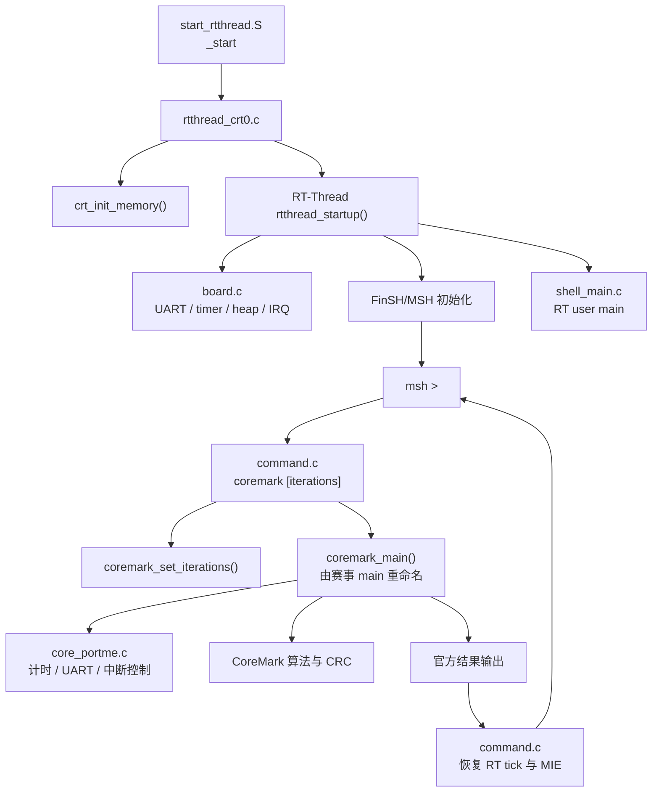

# 赛事软件接入说明

这份说明回答三个问题：赛事方给出的测试 C 程序最可能对应当前哪个文件；
`RT-Thread + MSH + CoreMark` 固件实际由哪些软件文件组成；为了接入赛事程序并把
结果归档到独立运行目录，需要改动项目的哪些位置。

## 1. 先给出判断

如果赛事方只提供一个“基于 CoreMark 源码的测试 C 程序”，它大概率对应：

```text
software/coremark/upstream/core_main.c
```

这里说的是**职责对应**，不表示收到文件后直接覆盖它。`core_main.c` 是 CoreMark
的测试驱动：定义 `main()`、设置种子和迭代次数、初始化测试数据、调用三个算法、
计时、核对 CRC 并打印最终结果。当前工程编译这个文件时，通过
`-Dmain=coremark_main` 把它变成一个可由 MSH 调用的函数。

赛事 C 程序通常不对应下面两个文件：

- `software/applications/rtthread/shell_main.c`：这是 RT-Thread 的用户 `main()`，
  只负责打印启动信息并让 MSH 保持可用；
- `software/coremark/port/rtthread/command.c`：这是 `coremark [iterations]` 的
  MSH 命令包装，负责调用测试程序并在结束后恢复 RT-Thread tick。

收到文件前仍不能把结论定死。赛事方可能交付修改后的 CoreMark 驱动、某一个
算法文件、完整单文件版本，或者一个只有 `main()` 的自包含测试。应先看文件中
定义的符号，再决定它替换构建中的哪一层。

### 按内容判断文件类型

| 赛事文件中的明显内容 | 对应当前层次 | 接入方式 |
| --- | --- | --- |
| `#include "coremark.h"`，同时定义 `main()`、`iterate()`、known CRC 和结果打印 | `core_main.c` | 最可能情况；保留标准算法与 SocRV port，只替换测试驱动 |
| 定义 `core_bench_list()`、`core_bench_matrix()` 或 `core_bench_state()` | `core_list_join.c`、`core_matrix.c` 或 `core_state.c` | 只替换对应算法源文件 |
| 定义 `crcu16()`、`crc16()`、`get_seed_32()` 等 | `core_util.c` 或 port 的一部分 | 按符号逐项核对，避免与现有实现重复定义 |
| 定义 `start_time()`、`stop_time()`、`portable_init()`、`ee_printf()` | `core_portme.c` / `ee_printf.c` | 属于平台适配；通常继续使用 SocRV 版本，除非规则要求采用赛事版本 |
| 只有一个普通 `main()`，不包含 `coremark.h` | 自包含测试入口 | 不能直接假设兼容 CoreMark；需要 adapter，并确认如何传入迭代次数、读取结果 |
| 同时提供多个 `.c/.h` 和 Makefile | 完整赛事软件包 | 建立显式源文件清单，不能只替换一个文件 |

最稳妥的做法是给每次赛事输入写一份配置，明确接入模式，不让脚本根据文件名猜：

```json
{
  "schema_version": 1,
  "mode": "core_main_replacement",
  "entry_source": "source/original/contest_coremark.c",
  "extra_sources": [],
  "entry_symbol": "main"
}
```

`mode` 至少应区分：

- `core_main_replacement`：赛事文件替代标准 `core_main.c`，其余 CoreMark 文件保留；
- `algorithm_replacement`：赛事文件只替代一个或多个算法文件；
- `complete_coremark_set`：赛事方提供完整 CoreMark 源文件集合；
- `standalone_test`：它不是标准 CoreMark 组织形式，需要专门 adapter。

## 2. 当前软件怎样启动并进入 CoreMark

当前 `rtthread-coremark` 的调用关系如下：



启动阶段的两个 `main` 不能混淆：

- RT-Thread 的真正用户入口是 `shell_main.c` 中的 `main()`；
- CoreMark 自带的 `main()` 在编译时改名为 `coremark_main()`，因此只是 MSH 命令
  内部调用的普通函数。

这也是赛事 C 文件不能直接替换 `shell_main.c` 的原因。替换后虽然可能运行测试，
RT-Thread 和 MSH 主线会被破坏。

## 3. `rtthread-coremark` 直接编译的源文件

权威源清单来自：

```powershell
wsl bash -lc "cd <repo> && make -s -C software PROFILE=rtthread-coremark print-sources"
```

下面按职责列出当前清单。

### RT-Thread 启动与 CPU port

| 文件 | 职责 |
| --- | --- |
| `software/rt-thread/port/start_rtthread.S` | 复位入口 `_start`，初始化 `gp/sp/mtvec`，进入 RT 启动 |
| `software/rt-thread/port/rtthread_crt0.c` | 清零/复制内存后调用 `rtthread_startup()` |
| `software/startup/crt0.c` | 提供共用的 `crt_init_memory()` |
| `software/rt-thread/port/trap_gcc.S` | RISC-V trap 保存与恢复 |
| `software/rt-thread/port/interrupt_gcc.S` | RT-Thread 中断入口 |
| `software/rt-thread/port/context_gcc.S` | 线程上下文切换 |
| `software/rt-thread/port/cpuport.c` | 初始线程栈和上下文切换请求 |
| `software/rt-thread/upstream/libcpu/risc-v/common/trap_common.c` | RT-Thread RISC-V 公共 trap 分发 |

这些文件配合以下头文件：

```text
software/rt-thread/port/rtconfig.h
software/rt-thread/port/cpuport.h
software/rt-thread/port/rt_hw_stack_frame.h
```

`rtconfig.h` 打开 `RT_USING_FINSH`、`FINSH_USING_MSH`、内存堆、用户 main 和
100 Hz 系统 tick。

### RT-Thread 内核与 FinSH/MSH

来自锁定的 RT-Thread v3.1.5：

```text
software/rt-thread/upstream/src/clock.c
software/rt-thread/upstream/src/components.c
software/rt-thread/upstream/src/cpu_up.c
software/rt-thread/upstream/src/defunct.c
software/rt-thread/upstream/src/idle.c
software/rt-thread/upstream/src/ipc.c
software/rt-thread/upstream/src/irq.c
software/rt-thread/upstream/src/kservice.c
software/rt-thread/upstream/src/mem.c
software/rt-thread/upstream/src/mempool.c
software/rt-thread/upstream/src/object.c
software/rt-thread/upstream/src/scheduler_comm.c
software/rt-thread/upstream/src/scheduler_up.c
software/rt-thread/upstream/src/thread.c
software/rt-thread/upstream/src/timer.c
software/rt-thread/upstream/src/klibc/kerrno.c
software/rt-thread/upstream/src/klibc/kstdio.c
software/rt-thread/upstream/src/klibc/kstring.c
software/rt-thread/upstream/src/klibc/rt_vsnprintf_tiny.c
software/rt-thread/upstream/components/finsh/shell.c
software/rt-thread/upstream/components/finsh/msh.c
software/rt-thread/upstream/components/finsh/msh_parse.c
software/rt-thread/upstream/components/finsh/cmd.c
```

`help`、`ps`、`free`、`version`、`list`、`clear` 等基础命令主要来自这里。
这些上游文件不应因赛事程序接入而修改。

### SoC BSP、运行库与 MSH 应用

| 文件 | 职责 |
| --- | --- |
| `software/rt-thread/port/board.c` | RT console、heap、timer tick、IRQ 初始化 |
| `software/bsp/drivers/drv_uart.c` | UART 输入输出 |
| `software/bsp/drivers/drv_timer.c` | 50 MHz `mtime/mtimecmp` 与 RT tick |
| `software/bsp/drivers/drv_irq.c` | 软件中断请求与清除 |
| `software/bsp/drivers/drv_gpio.c` | CoreMark 运行/完成 LED |
| `software/bsp/drivers/test_status.c` | PASS/FAIL 与性能窗口状态 |
| `software/runtime/platform.c` | 程序终止状态支持 |
| `software/runtime/minilibc.c` | `memcpy/strcmp/strtoul` 等最小 libc |
| `software/applications/rtthread/shell_main.c` | RT-Thread 用户 main，启动后保持 MSH 模式 |
| `software/applications/rtthread/commands/cmd_info.c` | `socrv_info` 与 `uptime` |

对应的接口和硬件合同来自：

```text
software/bsp/include/*.h
software/runtime/include/*.h
data/soc/memory_map.json
data/soc/software_contract.json
software/linker/memory.ldh
software/linker/socrv_code_data.ld
```

链接脚本还负责保留 `FSymTab`，否则 `MSH_CMD_EXPORT_ALIAS` 导出的 `coremark`、
`socrv_info` 和 `uptime` 命令不会出现在 shell 中。

### CoreMark 算法、测试驱动和 SocRV port

标准 CoreMark v1.01 源文件：

| 文件 | 职责 |
| --- | --- |
| `software/coremark/upstream/core_main.c` | 测试驱动、迭代、计时、CRC 检查、官方输出 |
| `software/coremark/upstream/core_list_join.c` | list workload |
| `software/coremark/upstream/core_matrix.c` | matrix workload |
| `software/coremark/upstream/core_state.c` | state-machine workload |
| `software/coremark/upstream/core_util.c` | CRC、seed 和公共工具 |
| `software/coremark/upstream/coremark.h` | CoreMark 类型和算法接口 |

SocRV 自己维护的适配：

| 文件 | 职责 |
| --- | --- |
| `software/coremark/port/common/core_portme.h` | CoreMark 类型、静态内存、计时频率和 port 配置 |
| `software/coremark/port/common/core_portme.c` | timer、关/恢复中断、GPIO、性能窗口、结果辅助接口 |
| `software/coremark/port/common/ee_printf.c` | 把 CoreMark 输出送到 UART |
| `software/coremark/port/common/cvt.c` | 浮点格式转换支持 |
| `software/coremark/port/rtthread/command.c` | 注册并实现 `coremark [iterations]` |

赛事方若提供的是 `core_main.c` 替代物，原则上只替换本表第一组中的测试驱动；
算法文件是否保留，由赛事文件引用和定义的符号决定。SocRV port 与 MSH command
继续保留。

## 4. 构建规则也属于软件链路

源文件之外，以下配置直接决定最后的 ELF：

| 文件 | 作用 |
| --- | --- |
| `software/Makefile` | 编译对象、链接、生成 BIN/MAP/DIS；目前只对固定的 `core_main.c` 重命名 `main` |
| `software/profiles/rtthread-coremark.mk` | 合并 RT-Thread、CoreMark、MSH command，设置 `-O3` 和迭代参数 |
| `software/profiles/rtthread_sources.inc` | RT 内核、port、BSP、FinSH 的源清单 |
| `software/profiles/coremark_sources.inc` | 标准 CoreMark 和 SocRV port 的源清单 |
| `software/toolchain/riscv_gcc.mk` | RISC-V GCC 工具名 |
| `software/toolchain/common_flags.mk` | `rv32imf_zicsr/ilp32f`、freestanding、链接选项 |
| `software/linker/socrv_code_data.ld` | ICCM/DCCM 段布局、堆栈和溢出检查 |
| `scripts/build_software.py` | 调用软件 Makefile、检查 ELF、生成 manifest 和存储镜像 |
| `scripts/elf2mem.py` | 将 ELF 拆成四个 ICCM lane 和八个 DCCM bank |
| `scripts/check_images.py` | 核对 ELF、memory map 和 `.mem` 哈希 |

这部分必须随比赛接入一起改造。只把赛事 C 文件放进目录而不更新 profile 和
Makefile，它不会自动进入最终 ELF。

## 5. 建议怎样处理赛事 C 文件

### 原始文件不动

每次输入保存在独立运行目录：

```text
competition_runs/<run-id>/
└── source/
    ├── original/             # 赛事方原文件
    ├── competition.json      # 接入模式和源清单
    ├── source_manifest.json  # SHA-256
    └── adapter/              # 项目侧适配；需要时才有
```

不要把赛事文件覆盖到 `software/coremark/upstream/`，也不要直接编辑
`source/original/`。如果赛事规则允许且确实需要修补，在 `source/adapter/` 或
`source/working/` 留下派生文件和明确 diff。

### 最可能情况：替换 `core_main.c`

如果文件符合 `core_main_replacement`，构建集合应为：

```text
RT-Thread + FinSH/MSH
SocRV BSP 和 runtime
赛事方测试 C（替代 core_main.c）
标准 core_list_join.c / core_matrix.c / core_state.c / core_util.c
SocRV core_portme.c / ee_printf.c / cvt.c
MSH command.c
shell_main.c / cmd_info.c
```

赛事文件的 `main()` 在编译时重命名为 `coremark_main()`。MSH 调用关系保持：

```text
coremark 10000
  -> cmd_coremark()
  -> coremark_set_iterations(10000)
  -> coremark_main()
  -> 返回 command.c
  -> 重挂 RT tick、恢复 MIE
  -> msh >
```

这种情况下，不需要新写一套 RT-Thread command；只需让编译系统对“本次赛事
入口文件”应用原来只给 `core_main.c` 的 `-Dmain=coremark_main` 规则。

### 若赛事文件是自包含 `main()`

如果它不使用标准 `coremark.h`，需要先回答：

1. 迭代次数能否在运行时传入；
2. 是否会自行初始化 UART/timer，和 RT-Thread 是否冲突；
3. 是否会永久循环或调用 `exit()`，导致无法返回 MSH；
4. 如何报告正确/错误与运行 ticks；
5. 是否依赖标准库、系统调用、动态内存或当前 ISA 不支持的指令。

此时应在 `source/adapter/` 提供稳定接口，例如：

```c
int contest_benchmark_run(uint32_t iterations,
                          uint64_t *ticks);
```

`command.c` 调 adapter，adapter 再调用赛事程序。赛事 `main` 可编译为
`contest_program_main`，但必须保证它结束后能返回。

### 不自动合并未知源文件

构建脚本可以自动检查重复符号和缺失文件，不能自动判断应该同时保留哪些
CoreMark 算法。这个选择应写进 `competition.json` 并进入构建 manifest。否则
同名函数可能重复链接，也可能不小心继续使用旧算法，得到一个能运行却不是赛事
要求的软件镜像。

## 6. 当前链路有一个结果状态问题

标准 `core_main.c` 在局部变量 `total_errors` 中统计 CRC 和“运行不足 10 秒”等
错误，并通过 UART 打印：

```text
Correct operation validated.
Errors detected
Cannot validate operation ...
```

但是它最后返回固定的 `MAIN_RETURN_VAL`。当前
`coremark_result_code()` 只反映 `core_portme.c` 的数据类型检查，不等于
`total_errors`。因此：

- 仿真 checker 会解析 UART，能够发现 CRC 错误；
- 人在串口上也能根据官方输出判断；
- `command.c` 写入的板级 PASS/FAIL 状态目前不一定代表真实 CRC 结论。

赛事接入时要确认新 C 程序怎样给出结果。如果它能返回真实错误码，adapter 应把
该错误码传给 `command.c`。如果赛事规则禁止修改标准 CoreMark 驱动，板级验收就
必须以完整 UART 输出为准，不能只看 PASS LED。不要用字符串拦截去伪造一个
“返回码”，除非赛事规则和验收方式已经明确允许。

## 7. 已完成的实现

### 新增文件

| 文件 | 内容 |
| --- | --- |
| `data/schemas/competition_source.schema.json` | 约束 `competition.json` 的 mode、入口和源文件清单 |
| `software/profiles/contest-rtthread-coremark.mk` | 比赛固件 profile，固定 RT-Thread + MSH + 赛事 CoreMark |
| `scripts/prepare_competition_run.py` | 创建 run-id、复制原始文件、生成 SHA-256 和配置模板 |
| `scripts/tests/test_competition_source.py` | 测试 source mode、hash、重复/缺失源文件和输出目录 |

### 已修改

| 文件 | 改动 |
| --- | --- |
| `software/Makefile` | 增加外部赛事源的专用对象规则；对配置指定的入口应用 `-Dmain=coremark_main`，不再硬编码唯一路径 |
| `scripts/build_software.py` | 注册比赛 profile；增加 `--run-dir`、`--competition-config`；把 ELF、MAP、DIS、BIN、size 和镜像写进本次目录 |
| `scripts/build_software.py` 的 source manifest 逻辑 | 允许记录 `software/` 之外、但位于仓库运行目录中的赛事源文件 |
| `scripts/run_verilator.py` | 注册比赛 profile 和短测试默认值；增加 `--run-dir`，归档 `result.json` 与 UART log |
| `data/tests/soc.json` | 增加 `contest-rtthread-coremark-command-3`，检查启动、CoreMark、`ps` 和 `help` |
| `scripts/validate_schemas.py` | 校验 `competition.json` |
| `docs/competition_final_workflow.md` | 把“尚待实现”命令更新为真实可执行命令，并链接本文 |
| `README.md` / `scripts/README.md` | 增加比赛软件入口与运行目录说明 |

当前只实现 `core_main_replacement`，因此没有加入 standalone adapter，也没有让脚本
自动选择算法替换或完整源码集。真实赛事文件不符合该模式时，再沿清楚的接口边界
补对应实现。

`software/coremark/port/rtthread/command.c` 是否修改取决于赛事接口：

- 赛事文件兼容标准 CoreMark：可继续使用现有 command，不必改；
- 赛事文件是 standalone：改为调用 `contest_benchmark_run()`；
- 赛事文件能返回真实 CRC/错误码：同步改进 test-status 的 PASS/FAIL 来源。

`software/coremark/port/common/core_portme.c/.h` 也应尽量保持不动。只有赛事程序的
port 合同不同，或者需要暴露真实结果状态时，才在清楚的接口边界上调整。

### 应保持不动

```text
software/coremark/upstream/**
software/rt-thread/upstream/**
rtl/**
fpga/boards/**/rtl/**
fpga/boards/**/constraints/**
fpga/boards/**/tcl/create_project.tcl
```

赛事软件接入正常情况下不需要改 RTL、板级约束或 Vivado 建工程 Tcl。Vivado 只
消费最终生成的 ICCM/DCCM `.mem` 文件。

`scripts/elf2mem.py` 已支持任意输出路径，通常无需修改；`scripts/check_images.py`
也已经接受指定的 `image.json`。主要工作集中在 profile、外部源编译规则、运行
目录和 manifest。

## 8. 已验证的基线

仓库锁定的标准 `core_main.c` 已按赛事文件处理：准备脚本先复制到独立 run，再由
`contest-rtthread-coremark` 编译。ELF 和十二个 ICCM/DCCM 镜像生成成功，短仿真
完成 `coremark 3 -> ps -> help`，RT-Thread 和 MSH 在 CoreMark 返回后仍正常。

现场拿到文件后，先运行准备脚本。若它能被判为 `core_main_replacement`，直接使用
同一流程；若准备脚本因多个入口不明确而停止，或编译出现重复符号、缺失 port
接口，再重新判断 mode，不要修改 `source/original/` 让它勉强通过。
